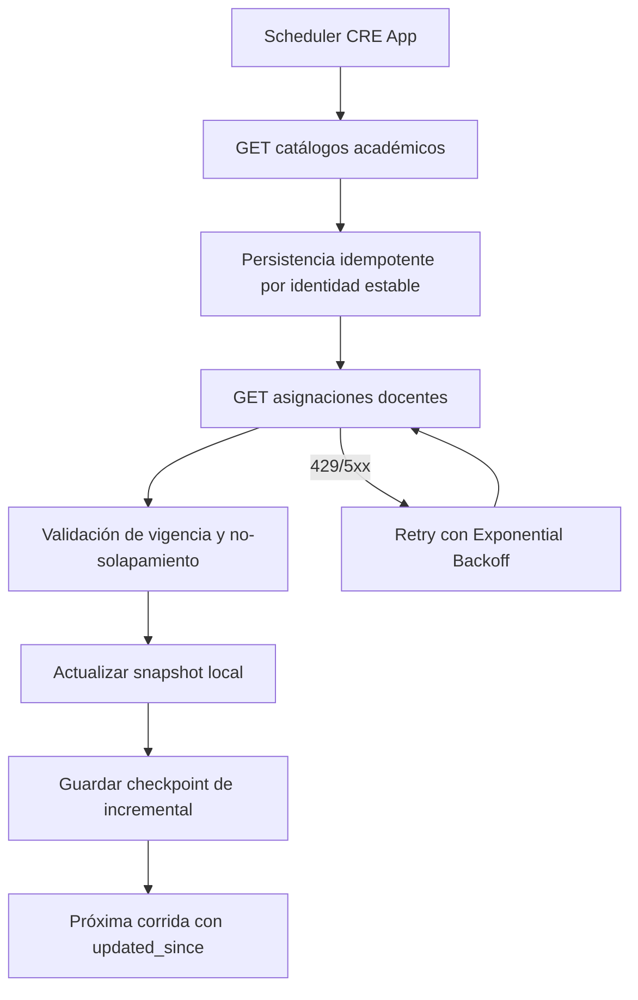

# Anexo Técnico
## Contrato API REST SIU Guaraní para consumo por CRE App

**Versión documento:** 1.0  
**Fecha:** 2026-03-02  
**Estado:** Propuesta técnica para validación inter-áreas

---

## 1. Lineamientos generales de diseño

- **Base URL (ejemplo):** `https://{host}/api/v1`
- **Content-Type:** `application/json; charset=utf-8`
- **Autenticación:** Bearer token OAuth2 (preferido)
- **Timezone:** UTC para campos datetime
- **Idempotencia de lectura:** todos los `GET` deben ser side-effect free

---

## 2. Convenciones de contrato

### 2.1 Campos transversales por recurso
Para una integración simple y robusta, se solicita al menos una opción por capacidad:

- **Identidad estable**: `id_externo` o equivalente institucional único e inmutable.
- **Estado/vigencia**: `activo` o par de vigencia (`vigente_desde`/`vigente_hasta`).
- **Detección de cambios**: `updated_at` o mecanismo equivalente para conocer modificaciones.

> Nota: CRE App se adapta al naming del API SIU. No se exige nombre literal de campos si la semántica es equivalente.

### 2.2 Paginación estándar
Se propone paginación `page/page_size` por simplicidad, pero se acepta cualquier esquema consistente (offset/limit o cursor).

**Justificación operativa (solicitud explícita):**
La paginación no se solicita por complejidad funcional, sino por estabilidad operativa. Permite limitar el tamaño de respuesta, reducir riesgo de timeout, controlar consumo de memoria del proceso de sincronización y reintentar solo bloques fallidos sin repetir toda la corrida.

**Opción sugerida (simple):**
- `page` (int, default 1)
- `page_size` (int, default 100, max 500)

**Alternativas aceptadas:**
- `offset` + `limit`
- `cursor`

**Response shape:**
```json
{
  "count": 1250,
  "next": "https://.../api/v1/recurso?page=2&page_size=100",
  "previous": null,
  "results": []
}
```

### 2.3 Filtro incremental
Para minimizar tráfico y evitar reprocesamientos, se solicita un mecanismo incremental.

**Opción sugerida:**
- `updated_since` (datetime ISO-8601 UTC)

**Alternativas aceptadas:**
- endpoint de cambios (`/changes`)
- versión/sequence por registro

Semántica requerida: devolver recursos con `updated_at >= updated_since`.

### 2.4 Principio de adaptación del consumidor
CRE App se adapta al contrato publicado por SIU Guaraní. Por lo tanto:

- no se exige que los nombres literales de enums coincidan con una taxonomía interna de CRE App;
- se solicita estabilidad semántica y documentación formal de catálogos;
- se recomienda exponer equivalencias mediante endpoint de catálogo o documentación OpenAPI.

### 2.5 Especificación formal de campos
Para consolidar el contrato técnico, cada campo publicado en OpenAPI debe incluir:

- tipo de dato (`string`, `integer`, `number`, `boolean`, `date`, `date-time`);
- obligatoriedad (`required`);
- nulabilidad (`nullable`);
- restricciones (`enum`, `min`, `max`, `pattern`, `format`).

---

## 3. Catálogos y enums de referencia (no bloqueantes)

Los siguientes valores son ejemplos de referencia funcional para facilitar el mapeo.  
**No constituyen una exigencia de nombres literales**; CRE App implementará adaptación/mapeo.

### 3.1 `tipo_espacio`
- `T1` Asignatura
- `T2` Seminario
- `T3` Taller/Laboratorio
- `T4` Actividad Profesional Especial

### 3.2 `periodo`
- `ANUAL`
- `1S`
- `2S`

### 3.3 `categoria_docente`
- `TIT`
- `ADJ`
- `ASO`
- `JTP`
- `AY1`
- `AY2`

### 3.4 Definiciones semánticas de campos clave

Las siguientes definiciones describen el significado funcional de campos críticos, independientemente del naming final que publique SIU.

| Campo | Significado esperado | Regla de interpretación |
|---|---|---|
| `tipo_espacio` | Clasificación académica/pedagógica del espacio curricular. | SIU define los valores válidos; CRE App los mapea internamente. |
| `periodo` | Ventana temporal de dictado del espacio (anual, semestral, etc.). | Debe indicar cuándo se cursa para validar planificación. |
| `categoria_docente` | Rol/categoría del docente dentro de la asignación. | Se usa para control y trazabilidad de la asignación. |
| `creditos` | Carga en créditos del plan o espacio según corresponda. | Debe ser numérico y no negativo. |
| `horas_ip` | Horas de interacción pedagógica (docencia directa). | Numérico, no negativo; insumo para validaciones de carga. |
| `horas_ta` | Horas de trabajo autónomo del estudiante. | Numérico, no negativo; complementa distribución horaria. |
| `anio_cursada` | Año sugerido de cursado en la trayectoria. | Entero positivo (`min=1`). |
| `vigente_desde` | Fecha de inicio de validez de un registro. | Obligatorio para entidades con vigencia temporal. |
| `vigente_hasta` | Fecha de fin de validez de un registro. | `null` implica vigencia abierta. |
| `activo` | Estado operativo actual del registro. | Si no existe, debe proveerse vigencia equivalente. |
| `updated_at` | Última modificación del registro en SIU. | Campo base para sincronización incremental. |
| `updated_since` | Filtro de consulta para traer cambios desde un corte temporal. | Debe devolver registros modificados desde el timestamp indicado. |

---

## 4. Endpoints requeridos

Estos endpoints representan el alcance funcional esperado. Se aceptan variaciones de naming/rutas, siempre que se cubra el dominio y se documente el mapeo.

## 4.1 Unidades Académicas
### GET `/unidades-academicas`

**Query params**
- `updated_since` (opcional)
- `page` (opcional)
- `page_size` (opcional)

**Contrato mínimo de campos (requerido para integración):**

| Campo | Tipo | Required | Nullable | Restricciones sugeridas |
|---|---|---|---|---|
| `id_externo` | string | Sí | No | único e inmutable |
| `codigo` | string | Sí | No | único en catálogo activo |
| `nombre` | string | Sí | No | longitud > 0 |
| `activo` o vigencia | boolean u objeto vigencia | Sí | Según modelo | estado de vigencia explícito |
| `updated_at` | date-time | Sí | No | ISO-8601 UTC |

**200 OK (ejemplo)**
```json
{
  "count": 1,
  "next": null,
  "previous": null,
  "results": [
    {
      "id_externo": "UA_FI",
      "codigo": "FI",
      "nombre": "Facultad de Ingeniería",
      "activo": true,
      "updated_at": "2026-03-01T12:00:00Z"
    }
  ]
}
```

---

## 4.2 Carreras
### GET `/carreras`

**Query params**
- `unidad_academica_codigo` (opcional)
- `updated_since` (opcional)
- `page` (opcional)
- `page_size` (opcional)

**Contrato mínimo de campos (requerido para integración):**

| Campo | Tipo | Required | Nullable | Restricciones sugeridas |
|---|---|---|---|---|
| `id_externo` | string | Sí | No | único e inmutable |
| `codigo` | string | Sí | No | recomendado único por unidad académica |
| `nombre` | string | Sí | No | longitud > 0 |
| `nivel` | string | Sí | No | enum documentado por SIU |
| `unidad_academica_codigo` | string | Sí | No | debe existir en unidades académicas |
| `activo` o vigencia | boolean u objeto vigencia | Sí | Según modelo | estado de vigencia explícito |
| `updated_at` | date-time | Sí | No | ISO-8601 UTC |

**200 OK (ejemplo)**
```json
{
  "count": 1,
  "next": null,
  "previous": null,
  "results": [
    {
      "id_externo": "CAR_ISI",
      "codigo": "ISI",
      "nombre": "Ingeniería en Sistemas de Información",
      "nivel": "G",
      "unidad_academica_codigo": "FI",
      "activo": true,
      "updated_at": "2026-03-01T12:10:00Z"
    }
  ]
}
```

---

## 4.3 Planes de Estudio
### GET `/planes-estudio`

**Query params**
- `carrera_codigo` (opcional)
- `vigente_en` (opcional, date `YYYY-MM-DD`)
- `updated_since` (opcional)
- `page` (opcional)
- `page_size` (opcional)

**Contrato mínimo de campos (requerido para integración):**

| Campo | Tipo | Required | Nullable | Restricciones sugeridas |
|---|---|---|---|---|
| `id_externo` | string | Sí | No | único e inmutable |
| `carrera_codigo` | string | Sí | No | debe existir en carreras |
| `nombre` | string | Sí | No | longitud > 0 |
| `ordenanza` | string | Recomendado | Sí | nomenclador institucional |
| `descripcion` | string | No | Sí | informativo |
| `creditos` | number/integer | Sí | No | `min=0` |
| `vigente_desde` | date | Sí | No | formato `YYYY-MM-DD` |
| `vigente_hasta` | date | No | Sí | `null` = vigencia abierta |
| `activo` o vigencia | boolean u objeto vigencia | Sí | Según modelo | coherente con rango temporal |
| `updated_at` | date-time | Sí | No | ISO-8601 UTC |

**200 OK (ejemplo)**
```json
{
  "count": 1,
  "next": null,
  "previous": null,
  "results": [
    {
      "id_externo": "PLAN_ISI_2025",
      "carrera_codigo": "ISI",
      "nombre": "Plan 2025",
      "ordenanza": "Ord-53/2025",
      "descripcion": "Plan de transición y consolidación",
      "creditos": 300,
      "vigente_desde": "2025-01-01",
      "vigente_hasta": null,
      "activo": true,
      "updated_at": "2026-03-01T12:20:00Z"
    }
  ]
}
```

---

## 4.4 Espacios Curriculares
### GET `/espacios-curriculares`

**Query params**
- `codigo` (opcional)
- `tipo_espacio` (opcional)
- `updated_since` (opcional)
- `page` (opcional)
- `page_size` (opcional)

**Contrato mínimo de campos (requerido para integración):**

| Campo | Tipo | Required | Nullable | Restricciones sugeridas |
|---|---|---|---|---|
| `id_externo` | string | Sí | No | único e inmutable |
| `codigo` | string | Sí | No | único por espacio |
| `nombre` | string | Sí | No | longitud > 0 |
| `tipo_espacio` | string | Sí | No | enum documentado por SIU |
| `anio_cursada` | integer | Sí | No | `min=1` |
| `periodo` | string | Sí | No | enum documentado por SIU |
| `creditos` | number/integer | Sí | No | `min=0` |
| `horas_ip` | number/integer | Sí | No | `min=0` |
| `horas_ta` | number/integer | Sí | No | `min=0` |
| `activo` o vigencia | boolean u objeto vigencia | Sí | Según modelo | estado de vigencia explícito |
| `updated_at` | date-time | Sí | No | ISO-8601 UTC |

> Nota: `horas_ip` y `horas_ta` deben ser numéricas para soportar validaciones de carga horaria y cálculos de consistencia en CRE App.

**200 OK (ejemplo)**
```json
{
  "count": 1,
  "next": null,
  "previous": null,
  "results": [
    {
      "id_externo": "EC_ALG1",
      "codigo": "ALG1",
      "nombre": "Álgebra I",
      "tipo_espacio": "T1",
      "anio_cursada": 1,
      "periodo": "ANUAL",
      "creditos": 6,
      "horas_ip": 45,
      "horas_ta": 105,
      "activo": true,
      "updated_at": "2026-03-01T12:30:00Z"
    }
  ]
}
```

---

## 4.5 Relación Plan ↔ Espacio Curricular
### GET `/planes-estudio-espacios`

**Query params**
- `plan_id_externo` (opcional)
- `espacio_codigo` (opcional)
- `updated_since` (opcional)
- `page` (opcional)
- `page_size` (opcional)

**Contrato mínimo de campos (requerido para integración):**

| Campo | Tipo | Required | Nullable | Restricciones sugeridas |
|---|---|---|---|---|
| `id_externo` | string | Sí | No | único e inmutable |
| `plan_id_externo` | string | Sí | No | debe existir en planes de estudio |
| `espacio_codigo` o `espacio_id_externo` | string | Sí | No | debe existir en espacios curriculares |
| `activo` o vigencia | boolean u objeto vigencia | Sí | Según modelo | estado de validez de la relación |
| `updated_at` | date-time | Sí | No | ISO-8601 UTC |

**200 OK (ejemplo)**
```json
{
  "count": 1,
  "next": null,
  "previous": null,
  "results": [
    {
      "id_externo": "PEC_PLAN_ISI_2025_ALG1",
      "plan_id_externo": "PLAN_ISI_2025",
      "espacio_codigo": "ALG1",
      "activo": true,
      "updated_at": "2026-03-01T12:40:00Z"
    }
  ]
}
```

---

## 4.6 Docentes
### GET `/docentes`

**Query params**
- `updated_since` (opcional)
- `legajo` (opcional)
- `email` (opcional)
- `page` (opcional)
- `page_size` (opcional)

**Contrato mínimo de campos (requerido para integración):**

| Campo | Tipo | Required | Nullable | Restricciones sugeridas |
|---|---|---|---|---|
| `id_externo` | string | Sí | No | único e inmutable |
| `legajo` | string | Recomendado | Sí | identificador administrativo |
| `username_sugerido` | string | No | Sí | informativo |
| `email` | string | Recomendado | Sí | formato email válido |
| `nombres` | string | Sí | No | longitud > 0 |
| `apellidos` | string | Sí | No | longitud > 0 |
| `activo` o vigencia | boolean u objeto vigencia | Sí | Según modelo | estado operativo explícito |
| `updated_at` | date-time | Sí | No | ISO-8601 UTC |

**200 OK (ejemplo)**
```json
{
  "count": 1,
  "next": null,
  "previous": null,
  "results": [
    {
      "id_externo": "DOC_12345",
      "legajo": "12345",
      "username_sugerido": "jperez",
      "email": "jperez@uncuyo.edu.ar",
      "nombres": "Juan",
      "apellidos": "Pérez",
      "activo": true,
      "updated_at": "2026-03-01T12:50:00Z"
    }
  ]
}
```

---

## 4.7 Asignaciones Docentes
### GET `/asignaciones-docentes`

**Query params**
- `docente_id_externo` (opcional)
- `espacio_codigo` (opcional)
- `vigente_en` (opcional, date)
- `updated_since` (opcional)
- `page` (opcional)
- `page_size` (opcional)

**Contrato mínimo de campos (requerido para integración):**

| Campo | Tipo | Required | Nullable | Restricciones sugeridas |
|---|---|---|---|---|
| `id_externo` | string | Sí | No | único e inmutable |
| `docente_id_externo` | string | Sí | No | debe existir en docentes |
| `espacio_codigo` o `espacio_id_externo` | string | Sí | No | debe existir en espacios curriculares |
| `categoria_docente` | string | Sí | No | enum documentado por SIU |
| `vigente_desde` | date | Sí | No | formato `YYYY-MM-DD` |
| `vigente_hasta` | date | No | Sí | `null` = vigencia abierta |
| `activo` o vigencia | boolean u objeto vigencia | Sí | Según modelo | coherente con rango temporal |
| `updated_at` | date-time | Sí | No | ISO-8601 UTC |

**200 OK (ejemplo)**
```json
{
  "count": 1,
  "next": null,
  "previous": null,
  "results": [
    {
      "id_externo": "ASIG_789",
      "docente_id_externo": "DOC_12345",
      "espacio_codigo": "ALG1",
      "categoria_docente": "JTP",
      "vigente_desde": "2024-03-01",
      "vigente_hasta": null,
      "activo": true,
      "updated_at": "2026-03-01T13:00:00Z"
    }
  ]
}
```

## 4.8 Diccionario detallado de campos (descriptivo)

Esta sección define en detalle el significado de cada campo para evitar ambigüedad de interpretación entre equipos.

### 4.8.1 Unidad Académica

| Campo | Descripción funcional | Tipo | Required | Nullable | Ejemplo | Observaciones |
|---|---|---|---|---|---|---|
| `id_externo` | Identificador institucional estable de la unidad académica. | string | Sí | No | `UA_FI` | No debe reutilizarse para otra unidad. |
| `codigo` | Código abreviado institucional de la unidad académica. | string | Sí | No | `FI` | Debe ser único en el catálogo activo. |
| `nombre` | Denominación oficial de la unidad académica. | string | Sí | No | `Facultad de Ingeniería` | Texto oficial publicado por SIU. |
| `activo` o vigencia | Indica si la unidad está vigente para operación actual. | boolean u objeto | Sí | Según modelo | `true` | Si no usan `activo`, exponer vigencia equivalente. |
| `updated_at` | Fecha-hora de última modificación del registro. | date-time | Sí | No | `2026-03-01T12:00:00Z` | UTC ISO-8601 para incremental. |

### 4.8.2 Carrera

| Campo | Descripción funcional | Tipo | Required | Nullable | Ejemplo | Observaciones |
|---|---|---|---|---|---|---|
| `id_externo` | Identificador estable de carrera en SIU. | string | Sí | No | `CAR_ISI` | Clave técnica para upsert. |
| `codigo` | Código institucional de carrera. | string | Sí | No | `ISI` | Recomendado único por unidad académica. |
| `nombre` | Nombre oficial de la carrera. | string | Sí | No | `Ingeniería en Sistemas de Información` | Puede incluir versión formal completa. |
| `nivel` | Nivel académico de la carrera. | string | Sí | No | `G` | Enum documentado por SIU (grado, posgrado, etc.). |
| `unidad_academica_codigo` | Código de unidad académica de pertenencia. | string | Sí | No | `FI` | Debe existir en catálogo de unidades. |
| `activo` o vigencia | Estado de vigencia de la carrera. | boolean u objeto | Sí | Según modelo | `true` | Permite bajas lógicas sin perder historia. |
| `updated_at` | Última modificación del registro. | date-time | Sí | No | `2026-03-01T12:10:00Z` | Campo base de sincronización incremental. |

### 4.8.3 Plan de Estudio

| Campo | Descripción funcional | Tipo | Required | Nullable | Ejemplo | Observaciones |
|---|---|---|---|---|---|---|
| `id_externo` | Identificador estable del plan de estudio. | string | Sí | No | `PLAN_ISI_2025` | No cambiar ante ajustes menores del plan. |
| `carrera_codigo` | Código de la carrera a la que pertenece el plan. | string | Sí | No | `ISI` | Integridad referencial obligatoria. |
| `nombre` | Nombre descriptivo del plan. | string | Sí | No | `Plan 2025` | Denominación oficial o interna publicada. |
| `ordenanza` | Norma/ordenanza que aprueba el plan. | string | Recomendado | Sí | `Ord-53/2025` | Si no existe, puede omitirse o ir null. |
| `descripcion` | Texto descriptivo del plan. | string | No | Sí | `Plan de transición` | Campo informativo. |
| `creditos` | Créditos totales del plan. | number/integer | Sí | No | `300` | `min=0`, usable para validaciones. |
| `vigente_desde` | Fecha de inicio de vigencia del plan. | date | Sí | No | `2025-01-01` | Formato `YYYY-MM-DD`. |
| `vigente_hasta` | Fecha fin de vigencia del plan. | date | No | Sí | `null` | `null` implica vigencia abierta. |
| `activo` o vigencia | Estado operativo del plan. | boolean u objeto | Sí | Según modelo | `true` | Coherente con fechas de vigencia. |
| `updated_at` | Última modificación del plan. | date-time | Sí | No | `2026-03-01T12:20:00Z` | Requerido para incremental. |

### 4.8.4 Espacio Curricular

| Campo | Descripción funcional | Tipo | Required | Nullable | Ejemplo | Observaciones |
|---|---|---|---|---|---|---|
| `id_externo` | Identificador estable del espacio curricular en SIU. | string | Sí | No | `EC_ALG1` | Clave estable de integración. |
| `codigo` | Código académico del espacio curricular. | string | Sí | No | `ALG1` | Recomendado único dentro de dominio SIU. |
| `nombre` | Nombre oficial de la materia/espacio. | string | Sí | No | `Álgebra I` | Debe reflejar nomenclador vigente. |
| `tipo_espacio` | Clasificación académica del espacio. | string | Sí | No | `T1` | Enum de SIU (CRE App mapea internamente). |
| `anio_cursada` | Año sugerido de cursada en la trayectoria. | integer | Sí | No | `1` | `min=1`. |
| `periodo` | Período de dictado (anual/semestre/etc.). | string | Sí | No | `ANUAL` | Enum de SIU; no se exige naming literal interno. |
| `creditos` | Créditos asignados al espacio. | number/integer | Sí | No | `6` | `min=0`. |
| `horas_ip` | Horas de interacción pedagógica asignadas. | number/integer | Sí | No | `45` | Debe ser numérico para validaciones de carga horaria. |
| `horas_ta` | Horas de trabajo autónomo asignadas. | number/integer | Sí | No | `105` | Debe ser numérico para validaciones de carga horaria. |
| `activo` o vigencia | Estado de vigencia del espacio curricular. | boolean u objeto | Sí | Según modelo | `true` | Si hay vigencia por fechas, documentarla. |
| `updated_at` | Última modificación del espacio. | date-time | Sí | No | `2026-03-01T12:30:00Z` | Base para sync incremental. |

### 4.8.5 Relación Plan ↔ Espacio Curricular

| Campo | Descripción funcional | Tipo | Required | Nullable | Ejemplo | Observaciones |
|---|---|---|---|---|---|---|
| `id_externo` | Identificador estable de la relación plan-espacio. | string | Sí | No | `PEC_PLAN_ISI_2025_ALG1` | Permite idempotencia en la tabla de unión. |
| `plan_id_externo` | Identificador del plan de estudio relacionado. | string | Sí | No | `PLAN_ISI_2025` | Debe existir en endpoint de planes. |
| `espacio_codigo` o `espacio_id_externo` | Identificador/código del espacio relacionado. | string | Sí | No | `ALG1` | Definir una sola estrategia de referencia. |
| `activo` o vigencia | Estado de validez de la relación. | boolean u objeto | Sí | Según modelo | `true` | Importante para historización curricular. |
| `updated_at` | Última modificación de la relación. | date-time | Sí | No | `2026-03-01T12:40:00Z` | Requerido para incremental. |

### 4.8.6 Docente

| Campo | Descripción funcional | Tipo | Required | Nullable | Ejemplo | Observaciones |
|---|---|---|---|---|---|---|
| `id_externo` | Identificador estable de docente en SIU. | string | Sí | No | `DOC_12345` | Clave principal de integración docente. |
| `legajo` | Número de legajo institucional. | string | Recomendado | Sí | `12345` | Útil para conciliación administrativa. |
| `username_sugerido` | Nombre de usuario sugerido para autenticación local. | string | No | Sí | `jperez` | Informativo; no obligatorio para identidad SIU. |
| `email` | Correo institucional del docente. | string | Recomendado | Sí | `jperez@uncuyo.edu.ar` | Validar formato email si aplica. |
| `nombres` | Nombre(s) del docente. | string | Sí | No | `Juan` | Texto nominal. |
| `apellidos` | Apellido(s) del docente. | string | Sí | No | `Pérez` | Texto nominal. |
| `activo` o vigencia | Estado de actividad del docente para operación. | boolean u objeto | Sí | Según modelo | `true` | Puede coexistir con estado laboral externo. |
| `updated_at` | Última modificación del registro docente. | date-time | Sí | No | `2026-03-01T12:50:00Z` | Soporta actualización incremental. |

### 4.8.7 Asignación Docente

| Campo | Descripción funcional | Tipo | Required | Nullable | Ejemplo | Observaciones |
|---|---|---|---|---|---|---|
| `id_externo` | Identificador estable de la asignación docente. | string | Sí | No | `ASIG_789` | Debe representar una asignación unívoca. |
| `docente_id_externo` | Identificador del docente asignado. | string | Sí | No | `DOC_12345` | Debe existir en endpoint de docentes. |
| `espacio_codigo` o `espacio_id_externo` | Identificador/código del espacio asignado. | string | Sí | No | `ALG1` | Debe existir en endpoint de espacios. |
| `categoria_docente` | Categoría o rol docente en la asignación. | string | Sí | No | `JTP` | Enum documentado por SIU; CRE App mapea internamente. |
| `vigente_desde` | Inicio de vigencia de la asignación. | date | Sí | No | `2024-03-01` | Requerido para control temporal. |
| `vigente_hasta` | Fin de vigencia de la asignación. | date | No | Sí | `null` | `null` implica asignación vigente sin fin definido. |
| `activo` o vigencia | Estado operativo de la asignación. | boolean u objeto | Sí | Según modelo | `true` | Debe ser coherente con rango de fechas. |
| `updated_at` | Última modificación de la asignación. | date-time | Sí | No | `2026-03-01T13:00:00Z` | Necesario para incremental y auditoría. |

### 4.8.8 Campos de paginación (si aplica esquema page/page_size)

| Campo | Descripción funcional | Tipo | Required | Nullable | Ejemplo | Observaciones |
|---|---|---|---|---|---|---|
| `count` | Total de registros que cumplen el filtro actual. | integer | Sí | No | `1250` | Facilita control de completitud. |
| `next` | URL de la siguiente página. | string(URL) | Sí | Sí | `https://...page=2` | `null` cuando no hay más páginas. |
| `previous` | URL de la página anterior. | string(URL) | Sí | Sí | `null` | `null` cuando se está en la primera página. |
| `results` | Lista de elementos de la página actual. | array | Sí | No | `[]` | Contiene recursos homogéneos por endpoint. |

---

## 5. Endpoint opcional de salud y metadatos

### GET `/health`
Uso recomendado para verificación de disponibilidad.

**200 OK (ejemplo)**
```json
{
  "status": "ok",
  "service": "siu-guarani-api",
  "version": "1.0.0",
  "timestamp": "2026-03-02T10:00:00Z"
}
```

### GET `/metadata`
Uso recomendado para versión de contrato y compatibilidad.

**200 OK (ejemplo)**
```json
{
  "api_version": "v1",
  "contract_version": "2026-03-02",
  "deprecation_policy_url": "https://..."
}
```

---

## 6. Modelo de errores

**Formato estándar de error**
```json
{
  "error": {
    "code": "VALIDATION_ERROR",
    "message": "Parámetro 'updated_since' inválido.",
    "details": {
      "updated_since": ["Debe respetar formato ISO-8601."]
    },
    "trace_id": "d9c3b8fe-66ba-4c5f-9d10-2fdc8db6e210"
  }
}
```

**HTTP status esperados**
- `200` OK
- `400` Bad Request
- `401` Unauthorized
- `403` Forbidden
- `404` Not Found
- `409` Conflict
- `429` Too Many Requests
- `500` Internal Server Error
- `503` Service Unavailable

### 6.1 Política de rate limiting (solicitada)
Se solicita explicitar operativamente:

- cuota (ejemplo: requests por minuto/hora por credencial);
- respuesta de límite alcanzado con `429`;
- encabezado `Retry-After` en segundos;
- encabezados de observabilidad de cuota (si están disponibles):
  - `X-RateLimit-Limit`
  - `X-RateLimit-Remaining`
  - `X-RateLimit-Reset`

Esto permite configurar el cliente consumidor con reintentos y Exponential Backoff de manera predecible.

---

## 7. Reglas de consistencia y vigencia

1. No reutilizar `id_externo` de registros dados de baja.
2. Asegurar integridad referencial entre códigos de recursos relacionados.
3. Para asignaciones docentes, la vigencia temporal debe estar modelada con:
   - `vigente_desde` obligatorio.
   - `vigente_hasta` nullable.
4. Para la misma dupla docente+espacio, SIU debe garantizar ausencia de solapamientos de vigencia temporal.

---

## 8. Políticas de cambio de contrato

1. Cambios breaking: sólo en `v2` o superior.
2. Cambios backward-compatible: permitidos en `v1` (campos nuevos opcionales).
3. Deprecación mínima sugerida: 90 días.
4. Comunicar cambios por canal formal + changelog.

---

## 9. Matriz de mapeo funcional (SIU → CRE App)

| Dominio SIU | Endpoint requerido | Uso en CRE App |
|---|---|---|
| Unidad académica | `/unidades-academicas` | Catálogo base institucional |
| Carrera | `/carreras` | Selección de carrera |
| Plan de estudio | `/planes-estudio` | Contexto académico del EC |
| Espacio curricular | `/espacios-curriculares` | Gestión de planificación |
| Relación plan-espacio | `/planes-estudio-espacios` | Validación de pertenencia |
| Docente | `/docentes` | Identidad de usuario docente |
| Asignación docente | `/asignaciones-docentes` | Autorización de acceso a EC |

---

## 10. Criterios técnicos de validación conjunta

- Respuesta correcta de endpoints con paginación y filtros.
- Integridad referencial validada en lote full.
- Sincronización incremental validada con `updated_since`.
- Manejo de errores con payload estándar y `trace_id`.
- Evidencia de pruebas en ambiente sandbox antes de productivo.

---

## 11. Fundamentos técnicos (rationale)

### 11.1 ¿Por qué solicitar `id_externo`, `activo` y `updated_at`?

- `id_externo`: permite identificar de forma estable un registro de SIU a lo largo del tiempo y evita duplicaciones en la sincronización.
- `activo`: permite gestionar bajas lógicas sin perder historial ni romper integridad referencial.
- `updated_at`: habilita sincronización incremental eficiente (solo cambios), reduciendo carga y tiempo.

Sin estas capacidades, la integración sigue siendo posible, pero con mayor costo operativo: más llamadas full, más riesgo de duplicados y menor trazabilidad.

### 11.2 ¿Qué sentido tienen `page` y `page_size`?

- Evitan respuestas masivas que pueden degradar rendimiento o provocar timeouts.
- Permiten procesar datos en lotes controlados y reintentar páginas fallidas sin repetir todo.
- Facilitan escalabilidad cuando aumenta el volumen institucional.

Si SIU ya usa otro esquema, CRE App puede adaptarse; lo importante es contar con paginación determinista.

### 11.3 ¿Qué significan `count`, `next`, `previous`, `results`?

- `count`: total de registros de la consulta.
- `next`: URL de la siguiente página (o `null` si no hay más).
- `previous`: URL de la página anterior (o `null` si es la primera).
- `results`: conjunto de elementos de la página actual.

Este patrón de paginación estandariza clientes y simplifica la navegación de datos.

No son obligatorios en forma literal: se admite cualquier estructura equivalente documentada.

### 11.4 Explicación del filtro incremental

El filtro `updated_since` permite pedir solo registros cambiados desde una fecha/hora de corte.

Ejemplo operativo:
1. CRE App guarda el último timestamp de sincronización exitosa.
2. En la próxima corrida consulta `GET /recurso?updated_since=<ultimo_timestamp>`.
3. SIU devuelve solo altas/modificaciones/bajas lógicas posteriores a ese corte.

Beneficios: menor tráfico, menor tiempo de proceso, menor impacto en ambos sistemas y mejor frecuencia de actualización.

Si no existe filtro incremental, la alternativa es sincronización full periódica; es más simple al inicio pero menos eficiente a mediano plazo.

---

## 12. Flujo de sincronización (referencia de integración)


