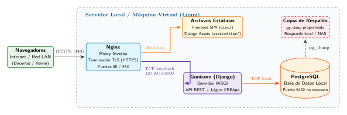
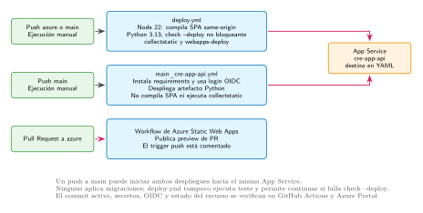

# Manual de Despliegue de CREApp

**Autor:** Juan Martín Morales
**Repositorio:** [github.com/juanm4morales/cre-app](https://github.com/juanm4morales/cre-app)
**Versión:** 1.0

CREApp es una SPA de React que consume una API Django sobre PostgreSQL. Hay **dos destinos válidos**: un servidor propio (self-hosted) o Microsoft Azure App Service. El procedimiento self-hosted ofrece pasos operativos detallados; la sección de Azure orienta el despliegue, pero debe completarse según la configuración real de los recursos y workflows de la institución.

Para el detalle técnico, ver [`APENDICES.md`](APENDICES.md): variables de entorno y [configuración efectiva](APENDICES.md#7-variables-de-entorno), [restricciones de la receta](APENDICES.md#2-restricciones-de-la-receta-self-hosted), [seguridad y HSTS](APENDICES.md#3-seguridad-y-entorno), [importadores y scripts](APENDICES.md#11-importadores-y-scripts) y [split-origin](APENDICES.md#13-nginx-y-despliegue-split-origin). Para la evidencia de las pruebas ejecutadas, ver [`validation/ACCEPTANCE_REPORT.md`](https://github.com/juanm4morales/cre-app/blob/docs/developer-handbook/docs/manuales/validation/ACCEPTANCE_REPORT.md).

## 1. Requisitos

| Componente | Versión |
|---|---|
| Python | 3.13 (venv) |
| Node.js | 22 LTS (solo para compilar el frontend) |
| PostgreSQL | 17 o superior soportado por el proveedor |
| Nginx | Cualquier versión estable reciente |

Los valores de CPU, RAM y disco son una orientación inicial, no un mínimo medido. Dimensione según carga y disponibilidad reales.

## 2. Despliegue self-hosted

Topología: Nginx termina TLS y sirve la SPA; Django corre con Gunicorn en `127.0.0.1:8000`; PostgreSQL acepta conexiones solo por loopback.



### Paso 1 — Usuarios, checkout y permisos

Se usan tres identidades: `creapp-build` compila, `creapp` ejecuta la aplicación y `www-data` sirve archivos. El código publicado nunca es escribible por el proceso web.

```sh
set -eu
SHA_APROBADO='<SHA_COMPLETO_APROBADO>'   # commit revisado y aprobado
REF_APROBADA='<REF_APROBADA>'           # rama o tag que lo contiene

if ! getent group creapp >/dev/null; then sudo groupadd --system creapp; fi
id -u creapp >/dev/null 2>&1 || sudo useradd --system --gid creapp --groups www-data \
  --home-dir /nonexistent --no-create-home --shell /usr/sbin/nologin creapp

if ! getent group creapp-build >/dev/null; then sudo groupadd --system creapp-build; fi
id -u creapp-build >/dev/null 2>&1 || sudo useradd --system --gid creapp-build \
  --groups www-data --home-dir /var/lib/creapp-build --create-home \
  --shell /usr/sbin/nologin creapp-build

sudo install -d -o root -g www-data -m 0750 /srv/creapp /srv/creapp/releases
sudo install -d -o root -g creapp -m 0750 /etc/creapp

RELEASE="/srv/creapp/releases/$SHA_APROBADO"
test ! -e "$RELEASE" || { echo 'El release ya existe' >&2; exit 1; }
sudo install -d -o creapp-build -g www-data -m 0750 "$RELEASE"

sudo -H -u creapp-build git clone --no-checkout \
  https://github.com/juanm4morales/cre-app.git "$RELEASE"
sudo -H -u creapp-build git -C "$RELEASE" fetch --no-tags origin "$REF_APROBADA"
sudo -H -u creapp-build git -C "$RELEASE" checkout --detach "$SHA_APROBADO"
test "$(sudo -H -u creapp-build git -C "$RELEASE" rev-parse HEAD)" = "$SHA_APROBADO"
```

Ejecute todos los bloques ejecutables `sh` de los pasos 1–7 en una misma sesión Bash: `set -eu` y las variables `SHA_APROBADO`, `REF_APROBADA` y `RELEASE` se mantienen entre bloques. Los bloques SQL, INI, `conf` y Nginx son contenido para sus herramientas, no comandos Bash. Si retoma el procedimiento en una sesión nueva, vuelva a definir ambos valores aprobados y valide el release antes de seguir:

```sh
: "${SHA_APROBADO:?Defina el SHA aprobado}" "${REF_APROBADA:?Defina la referencia aprobada}"
git check-ref-format "$REF_APROBADA"
RELEASE="/srv/creapp/releases/$SHA_APROBADO"
test "$(sudo -H -u creapp-build git -C "$RELEASE" rev-parse HEAD)" = "$SHA_APROBADO"
```

Deténgase si alguna comprobación falla.

### Paso 2 — PostgreSQL privado

```sh
sudo -u postgres psql
```

```sql
CREATE ROLE creapp_usr LOGIN;
\password creapp_usr
CREATE DATABASE creapp_db OWNER creapp_usr ENCODING 'UTF8';
\q
```

Fije `listen_addresses = '127.0.0.1'` en `postgresql.conf` y agregue al inicio de `pg_hba.conf`:

```conf
host    creapp_db    creapp_usr    127.0.0.1/32    scram-sha-256
```

```sh
sudo systemctl restart postgresql
sudo ss -ltnp | grep 5432     # debe mostrar solo 127.0.0.1
```

Nunca abra 5432 a la red. Para una base remota consulte el apéndice sobre TLS.

### Paso 3 — Archivo de entorno

```sh
sudo install -o root -g creapp -m 0640 /dev/null /etc/creapp/creapp.env
sudoedit /etc/creapp/creapp.env
```

```ini
DEBUG=False
SECRET_KEY=<generado con python3 -c 'import secrets; print(secrets.token_urlsafe(50))'>
ALLOWED_HOSTS=<FQDN_REAL>
POSTGRES_DB=creapp_db
POSTGRES_USER=creapp_usr
POSTGRES_PASSWORD=<secreto>
POSTGRES_HOST=127.0.0.1
POSTGRES_PORT=5432
CSRF_TRUSTED_ORIGINS=https://<FQDN_REAL>
CSRF_COOKIE_SECURE=True
SESSION_COOKIE_SECURE=True
CSRF_COOKIE_SAMESITE=Lax
SESSION_COOKIE_SAMESITE=Lax
SECURE_SSL_REDIRECT=True
```

`ALLOWED_HOSTS` lleva hostnames sin esquema. El archivo es de systemd, no un script de shell: use líneas `NOMBRE=valor` sin `export` ni comillas, y no haga `source`.

### Paso 4 — Compilar, migrar y recolectar estáticos

El frontend se compila **antes** de `collectstatic`, porque el build entra en los estáticos de Django. Las migraciones son una operación separada y autorizada.

```sh
set -eu
: "${SHA_APROBADO:?Defina el SHA aprobado para esta sesión}" "${REF_APROBADA:?Defina la referencia aprobada para esta sesión}"
git check-ref-format "$REF_APROBADA"
RELEASE="/srv/creapp/releases/$SHA_APROBADO"
test "$(sudo -H -u creapp-build git -C "$RELEASE" rev-parse HEAD)" = "$SHA_APROBADO"

sudo -H -u creapp-build python3.13 -m venv "$RELEASE/.venv"
sudo -H -u creapp-build "$RELEASE/.venv/bin/pip" install --upgrade pip
sudo -H -u creapp-build "$RELEASE/.venv/bin/pip" install -r "$RELEASE/requirements.txt"

sudo -H -u creapp-build sh -c 'cd "$1/frontend" && npm ci && \
  VITE_API_URL=/api VITE_STATIC_BASE=/api/static/ npm run build' sh "$RELEASE"

# El código publicado no se modifica desde aquí en adelante.
sudo chown -R root:www-data "$RELEASE"
sudo find "$RELEASE" -type d -exec chmod 0750 {} +
sudo find "$RELEASE" -type f -exec chmod u=rwX,g=rX,o= {} +
sudo install -d -o creapp -g www-data -m 2750 "$RELEASE/backend/staticfiles"
```

Los comandos Django se ejecutan con el entorno de producción. **Deténgase antes de `migrate --noinput`** hasta confirmar la identidad de la base configurada, revisar y aprobar el plan, resolver los hallazgos de `check --deploy`, y disponer de un backup reciente cuya restauración haya sido validada en una base aislada. Ejecute la migración únicamente en la ventana aprobada; si cualquiera de estas condiciones falta, no migre.

```sh
as_app() {
  sudo systemd-run --wait --pipe --collect \
    -p User=creapp -p Group=creapp -p SupplementaryGroups=www-data \
    -p WorkingDirectory="$RELEASE/backend" \
    -p EnvironmentFile=/etc/creapp/creapp.env \
    "$RELEASE/.venv/bin/python" "manage.py" "$@"
}

as_app check --deploy                              # sin silenciar warnings
as_app migrate --plan                              # solo muestra el plan
as_app migrate --noinput
as_app collectstatic --noinput
```

### Paso 5 — Servicio systemd

`/etc/systemd/system/creapp.service`:

```ini
[Unit]
Description=CREApp Django Service
After=network.target postgresql.service

[Service]
Type=simple
User=creapp
Group=creapp
SupplementaryGroups=www-data
WorkingDirectory=/srv/creapp/current/backend
EnvironmentFile=/etc/creapp/creapp.env
UMask=0027
ExecStart=/srv/creapp/current/.venv/bin/gunicorn \
    --workers 3 --bind 127.0.0.1:8000 config.wsgi:application
Restart=always
RestartSec=5

[Install]
WantedBy=multi-user.target
```

```sh
sudo systemctl daemon-reload
```

No inicie el servicio todavía: `current` se publica en el paso 7.

### Paso 6 — Nginx

`/etc/nginx/sites-available/creapp`:

```nginx
server {
    listen 80;
    server_name <FQDN_REAL>;
    return 301 https://$host$request_uri;
}

server {
    listen 443 ssl http2;
    server_name <FQDN_REAL>;
    ssl_certificate     <RUTA_FULLCHAIN_PEM>;
    ssl_certificate_key <RUTA_PRIVKEY_PEM>;
    client_max_body_size 25M;

    # Evita que el fallback SPA devuelva HTML en /api.
    location = /api { return 308 /api/; }

    location ^~ /api/static/ {
        alias /srv/creapp/current/backend/staticfiles/;
        expires 30d;
        access_log off;
    }

    location /api/ {
        proxy_pass http://127.0.0.1:8000;
        proxy_set_header Host $host;
        proxy_set_header X-Real-IP $remote_addr;
        proxy_set_header X-Forwarded-For $proxy_add_x_forwarded_for;
        proxy_set_header X-Forwarded-Proto $scheme;
    }

    location = /healthz {
        proxy_pass http://127.0.0.1:8000;
        proxy_set_header Host $host;
        proxy_set_header X-Forwarded-Proto $scheme;
    }

    location / {
        root /srv/creapp/current/frontend/dist;
        index index.html;
        try_files $uri $uri/ /index.html;
    }
}
```

Nginx debe sobrescribir `X-Forwarded-Proto`: Django confía en esa cabecera. Gunicorn y PostgreSQL no se exponen en el firewall.

### Paso 7 — Publicar y verificar

**Deténgase antes de cambiar `current`** si build, migraciones autorizadas o `collectstatic` fallaron; compruebe también que TLS, la configuración de Nginx y el destino del release son los aprobados, y que el release anterior sigue disponible para volver atrás. No publique si la compatibilidad del esquema con el release anterior no está confirmada.

Solo después de cumplir esas condiciones se publica el release:

```sh
set -eu
: "${SHA_APROBADO:?Defina el SHA aprobado para esta sesión}" "${REF_APROBADA:?Defina la referencia aprobada para esta sesión}"
git check-ref-format "$REF_APROBADA"
RELEASE="/srv/creapp/releases/$SHA_APROBADO"
test "$(sudo -H -u creapp-build git -C "$RELEASE" rev-parse HEAD)" = "$SHA_APROBADO"
test -d "$RELEASE/backend/staticfiles"
test ! -e /srv/creapp/current.next
sudo ln -s "$RELEASE" /srv/creapp/current.next
sudo mv -Tf /srv/creapp/current.next /srv/creapp/current
sudo nginx -t && sudo systemctl reload nginx
sudo systemctl enable --now creapp     # primera instalación
# sudo systemctl restart creapp      # en actualizaciones
```

Pruebas de humo con el dominio real:

```sh
curl -fsS -D - 'https://<FQDN_REAL>/healthz'                 # 200 text/plain, cuerpo ok
curl -fsS -D - 'https://<FQDN_REAL>/api/auth/csrf'          # JSON, no HTML
curl -fsS -D - 'https://<FQDN_REAL>/api'                    # 308 hacia /api/
curl -fsS -D - 'https://<FQDN_REAL>/ruta-spa-profunda'      # HTML de la SPA
```

Pruebe además el login y `/api/sadmin-creapp-panel/`. `/healthz` no consulta PostgreSQL.

Para revertir, apunte el symlink al release anterior y reinicie, solo si la base sigue siendo compatible. El código no se revierte junto con las migraciones.

## 3. Respaldos y restauración

Cree una cuenta y un `.pgpass` protegidos para que la contraseña no aparezca en comandos ni logs.

```sh
if ! getent group creapp-backup >/dev/null; then sudo groupadd --system creapp-backup; fi
id -u creapp-backup >/dev/null 2>&1 || sudo useradd --system --gid creapp-backup \
  --create-home --home-dir /var/lib/creapp-backup --shell /usr/sbin/nologin creapp-backup
sudo install -d -o creapp-backup -g creapp-backup -m 0700 /var/backups/creapp
sudo install -o creapp-backup -g creapp-backup -m 0600 /dev/null /var/lib/creapp-backup/.pgpass
sudoedit /var/lib/creapp-backup/.pgpass    # chmod 0600
```

```text
127.0.0.1:5432:creapp_db:creapp_usr:<PASSWORD_REAL>
127.0.0.1:5432:creapp_restore_test:creapp_usr:<PASSWORD_REAL>
```

```sh
sudo -u creapp-backup env PGPASSFILE=/var/lib/creapp-backup/.pgpass \
  /bin/sh -c 'umask 077; exec /usr/bin/pg_dump -h 127.0.0.1 -U creapp_usr -F c \
  -f "/var/backups/creapp/creapp_$(date +%F_%H%M%S).dump" creapp_db'
```

Para restaurar, primero haga un ensayo en una base vacía y aislada. Nunca restaure sobre la base viva ni use `pg_restore --clean` como rollback.

```sh
sudo -u postgres createdb -O creapp_usr creapp_restore_test
sudo -u creapp-backup env PGPASSFILE=/var/lib/creapp-backup/.pgpass \
  pg_restore --exit-on-error --single-transaction -h 127.0.0.1 \
  -U creapp_usr -d creapp_restore_test /var/backups/creapp/creapp_<FECHA>.dump
```

La base de ensayo necesita su propia regla en `pg_hba.conf`, que se retira al terminar. Compare recuentos y datos representativos con el origen.

## 4. Despliegue en Azure



### Paso 1 — PostgreSQL Flexible Server

1. Cree el servidor con autenticación por contraseña.
2. En el firewall autorice **todas** las direcciones de `Outbound IP addresses` y `Additional outbound IP addresses` del App Service. Autorizar solo una produce fallos intermitentes.
3. No active "permitir acceso público desde cualquier servicio de Azure": abre el acceso a cualquier tenant.
4. Con Private Endpoint, el App Service necesita VNet Integration en su propia subred y DNS privado que resuelva el nombre del servidor. Son dos recursos de red distintos.

### Paso 2 — App Service

App Service (Linux) con runtime Python 3.13 y un plan acorde a la carga.

### Paso 3 — Application Settings

```ini
DEBUG=False
SECRET_KEY=<secreto>
ALLOWED_HOSTS=<FQDN_APP_SERVICE>
POSTGRES_DB=creapp_db
POSTGRES_USER=creapp_usr
POSTGRES_PASSWORD=<secreto>
POSTGRES_HOST=<FQDN_POSTGRESQL>
POSTGRES_PORT=5432
CSRF_TRUSTED_ORIGINS=https://<FQDN_APP_SERVICE>
CSRF_COOKIE_SECURE=True
SESSION_COOKIE_SECURE=True
CSRF_COOKIE_SAMESITE=Lax
SESSION_COOKIE_SAMESITE=Lax
SECURE_SSL_REDIRECT=True
```

Los cambios de variables no recargan el proceso: pulse **Restart** en el portal. Las variables `VITE_*` son de compilación, no de runtime; `deploy.yml` compila con `/api` y `/api/static/`.

### Paso 4 — Startup Command

```sh
gunicorn --bind=0.0.0.0:8000 --timeout 600 --chdir backend config.wsgi:application
```

### Paso 5 — GitHub Actions

1. `deploy.yml` requiere `AZURE_WEBAPP_PUBLISH_PROFILE` y se activa con push a sus ramas de filtro o manualmente. Compila el frontend, ejecuta `collectstatic` y publica.
2. `main_cre-app-api.yml` despliega a la misma aplicación con otro paquete. Si ambas ramas de filtro se activan en un mismo push, se despliega dos veces. Use una sola rama de release.
3. El workflow de Static Web Apps tiene el push desactivado: solo previsualiza pull requests.

Los workflows no ejecutan pruebas ni migraciones, y `check --deploy` es no bloqueante. Un workflow en verde no acredita salud, migraciones ni base de datos.

### Paso 6 — Verificación

El arranque en frío puede tardar 30 a 90 segundos: configure los tiempos de espera de monitoreo en 90 s o más. Valide `/healthz` y una ruta de API JSON.

## 5. Problemas frecuentes

| Síntoma | Causa probable | Qué revisar |
|---|---|---|
| 502 Bad Gateway | Gunicorn detenido | `systemctl status creapp`, `journalctl -u creapp -n 30`, `ss -ltnp \| grep 8000` |
| 400 Bad Request | Host no permitido | `ALLOWED_HOSTS` en `/etc/creapp/creapp.env`, luego reiniciar |
| 403 CSRF | Origen no confiable | `CSRF_TRUSTED_ORIGINS` con el dominio exacto y acceso por HTTPS |
| Error de conexión a PostgreSQL | Credenciales o servicio | `systemctl status postgresql`, `psql -h 127.0.0.1 -U creapp_usr -d creapp_db` |
| 404 de CSS o JS | Faltó el build o `collectstatic` | `readlink -f /srv/creapp/current`, manifest, `alias` de `/api/static/` |
| HTML en una ruta `/api` | Fallback SPA | Regla `location = /api` presente y `proxy_pass` correcto |

## 6. Qué se comprobó

El harness de aceptación ejecutó el recorrido completo en un entorno aislado: Node 22, Python 3.13, PostgreSQL 17, Gunicorn y Nginx con TLS de prueba. Pasaron 54 pruebas frontend, 78 pruebas Django, las migraciones desde base vacía, la sesión con CSRF, el panel de administración, los estáticos y un ciclo de respaldo y restauración.

Ese recorrido **no** cubre Azure, una VM con systemd, DNS o certificados públicos, PostgreSQL remoto ni la política real de cookies del navegador. Repita estas verificaciones contra el destino que vaya a usar. Los detalles están en [`validation/ACCEPTANCE_REPORT.md`](https://github.com/juanm4morales/cre-app/blob/docs/developer-handbook/docs/manuales/validation/ACCEPTANCE_REPORT.md).

## 7. Referencias

- [Django: lista de comprobación para producción](https://docs.djangoproject.com/es/6.0/howto/deployment/checklist/)
- [Django: archivos estáticos](https://docs.djangoproject.com/es/6.0/howto/static-files/)
- [Django: referencia de settings](https://docs.djangoproject.com/es/6.0/ref/settings/)
- [Gunicorn: despliegue con systemd](https://docs.gunicorn.org/en/stable/deploy.html#systemd)
- [Nginx: módulo de proxy inverso](https://nginx.org/en/docs/http/ngx_http_proxy_module.html)
- [Nginx: servidores HTTPS](https://nginx.org/en/docs/http/configuring_https_servers.html)
- [PostgreSQL: pg_dump y pg_restore](https://www.postgresql.org/docs/current/backup.html)
- [PostgreSQL: pg_hba.conf](https://www.postgresql.org/docs/current/auth-pg-hba-conf.html)
- [Azure: Python en App Service](https://learn.microsoft.com/azure/app-service/configure-language-python)
- [Azure: PostgreSQL Flexible Server](https://learn.microsoft.com/azure/postgresql/flexible-server/overview)
- [Azure: VNet Integration](https://learn.microsoft.com/azure/app-service/overview-vnet-integration)
- [systemd.service](https://www.freedesktop.org/software/systemd/man/systemd.service.html)
