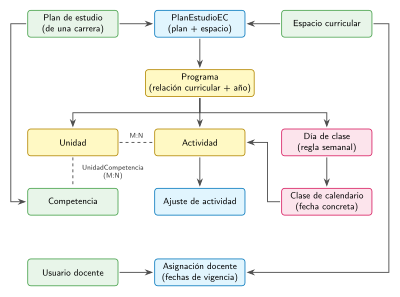
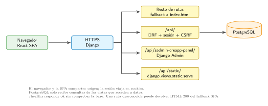
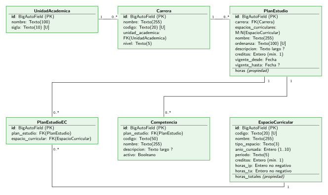
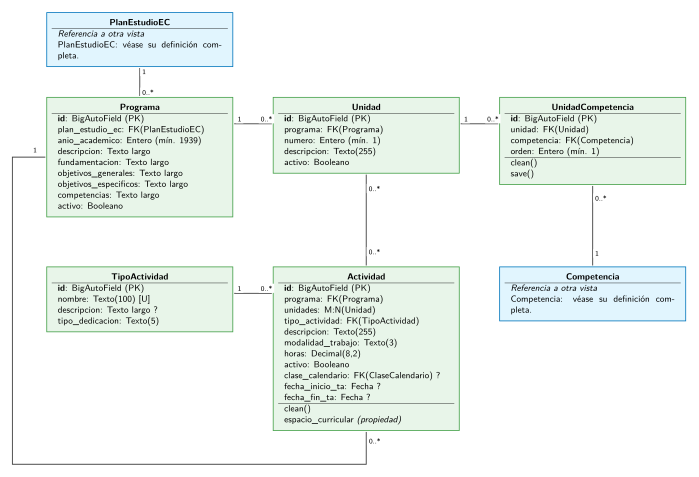
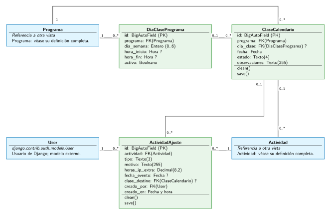
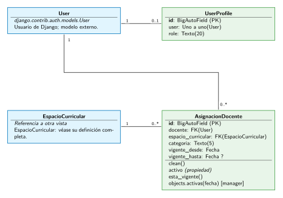

# Manual de Arquitectura y Desarrollo de CREApp
## Especificación de dominio, contratos de API y procedimientos técnicos

**Autor:** Juan Martín Morales  
**Repositorio:** [https://github.com/juanm4morales/cre-app](https://github.com/juanm4morales/cre-app)  
**Versión:** 2.0 (Desarrollo y Mantenimiento)

Este manual establece la arquitectura técnica, las reglas de negocio del dominio académico y de planificación, los contratos de la API REST y las directivas de desarrollo para el sistema **CREApp**.

Para especificaciones de infraestructura, aprovisionamiento de PostgreSQL, configuración de Nginx/Gunicorn, respaldos y procedimientos de despliegue on-premises, consultar el [Manual Operativo de Despliegue y Administración](DEPLOYMENT_MANUAL.md).

## Modelo de datos y flujo HTTP

El modelo relaciona el catálogo institucional con los programas académicos, sus unidades temáticas y las actividades de planificación docente. La figura representa las relaciones principales entre entidades: las flechas van desde cada entidad hacia los registros dependientes; las líneas discontinuas indican relaciones de muchos a muchos ($M:N$). El acceso docente se encuentra estrictamente delimitado por el espacio curricular asignado y la vigencia temporal de dicha asignación.



En el despliegue de mismo origen (*same-origin*), el navegador interactúa tanto con la SPA como con la API de Django a través del mismo dominio. El proxy inverso Nginx (o el servidor WSGI) canaliza las rutas dinámicas hacia la API y el panel de administración, y entrega los archivos estáticos y la plantilla de la SPA para las restantes rutas:



## Estructura del repositorio

| Directorio | Responsabilidad arquitectónica |
|---|---|
| `backend/config/` | Configuración global (`settings.py`), enrutamiento raíz (`urls.py`), enrutamiento de API (`api_urls.py`), middlewares y puntos de entrada WSGI/ASGI. |
| `backend/accounts/` | Modelo de usuario, perfil (`UserProfile`), roles institucionales, autenticación por sesión, permisos de API y gestión de docentes. |
| `backend/academics/` | Configuración de créditos (CRE) y catálogo académico: unidades académicas, carreras, planes de estudio, espacios curriculares y competencias. Incluye comandos de importación XLSX. |
| `backend/planning/` | Asignaciones docentes, programas, unidades temáticas, agenda semanal, calendario y actividades (IP/TA). Servicios de generación de calendario y pruebas de integración. |
| `frontend/src/App.tsx` | Enrutamiento de la SPA y carga diferida (*lazy loading*) de componentes de página. |
| `frontend/src/contexts/`, `services/`, `hooks/` | Estado de autenticación en cliente, cliente Axios centralizado, manejo de token CSRF, selección de espacio curricular y temas visuales. |
| `frontend/src/pages/admin/`, `pages/docente/` | Vistas organizadas por rol de usuario (Administrador y Docente). |
| `frontend/src/components/` | Componentes de presentación, formularios, tablas, diálogos de confirmación y calendario de planificación. |

## Estrategia de ramas y flujo de trabajo en Git

El repositorio organiza el ciclo de vida del código mediante las siguientes ramas principales:

* **`azure` (Rama Canónica de Producto y Despliegue):** Es la rama principal de referencia técnica para el modelo same-origin (`/api/static/`, `/api/sadmin-creapp-panel/`). Todo desarrollo de nuevas funcionalidades, corrección de errores o cambios de modelo debe integrarse primero en `azure`.
* **`azure-same-origin` (Variante de Despliegue):** Es una variante técnica derivada de `azure`. La divergencia intencional respecto a `azure` se restringe estrictamente a configuraciones de enrutamiento y despliegue (`backend/config/settings.py`, `backend/config/urls.py`, `frontend/src/App.tsx`, `frontend/vite.config.js`). Nunca debe utilizarse como una segunda rama de producto ni contener lógica de dominio independiente: las modificaciones compartidas deben aterrizar primero en `azure` y luego sincronizarse hacia adelante (*sync forward*).
* **`main`, `dev` y `frontend-modernization` (contexto histórico):** ramas de etapas anteriores del desarrollo; no son ramas de producto canónicas ni la referencia para nuevos cambios compartidos. En particular, no asumir que sus workflows, rutas o dependencias reflejan el estado actual de `azure`.
* **`docs/developer-handbook`:** rama dedicada únicamente a la documentación técnica y sus fuentes/diagramas. No es una rama de producto ni de despliegue.

---

# Parte I — Backend

## 1. Tecnologías, dependencias y entorno local

### Requisitos de plataforma

* **Backend:** Python 3.13 (versión usada por el workflow). Dependencias fijadas en `requirements.txt`.
* **Motor de base de datos:** PostgreSQL 17 con codificación UTF-8 (versión del Compose de desarrollo).
* **Frontend:** Node.js 22 LTS y npm (versiones de dependencias fijadas en `frontend/package-lock.json`).

### Componentes del stack tecnológico

CREApp desacopla la interfaz de usuario de la lógica de negocio y de la persistencia relacional. El cliente ejecuta una aplicación de página única (SPA) en el navegador; Django atiende las peticiones HTTP, gestiona sesiones y tokens CSRF, evalúa permisos a nivel de vista y objeto, y consulta la base de datos PostgreSQL mediante su ORM.

| Componente | Tecnología | Responsabilidad y características técnicas |
|---|---|---|
| Lenguajes de desarrollo | [Python 3.13](https://docs.python.org/3.13/) / [TypeScript 5.9](https://www.typescriptlang.org/docs/) | Python ejecuta la lógica de backend; TypeScript garantiza tipado estático en la capa de interfaz. |
| Backend web | [Django 6.0](https://docs.djangoproject.com/es/6.0/) | Modelos relacionales, ORM, migraciones automáticas, sesiones del servidor, validación y panel de administración. |
| API REST | [Django REST Framework 3.16](https://www.django-rest-framework.org/) | Serializadores, viewsets, enrutador automático y permisos de acceso basados en sesión y roles. |
| Base de datos | [PostgreSQL 17](https://www.postgresql.org/docs/) | Persistencia relacional, integridad referencial y transacciones ACID. Controlador [`psycopg` 3.2](https://www.psycopg.org/psycopg3/docs/). |
| Interfaz de usuario | [React 19](https://react.dev/) / [Vite 7](https://vite.dev/) | Renderizado de componentes mediante React DOM. Enrutamiento del lado del cliente con [React Router 7](https://reactrouter.com/). |
| Cliente HTTP | Axios (rango declarado `^1.13.2`) | Peticiones HTTP centralizadas con inclusión de credenciales (`withCredentials: true`) y cabecera `X-CSRFToken`. La versión exacta resuelta se registra en `frontend/package-lock.json`. |
| Caché en cliente | [TanStack Query 5.100](https://tanstack.com/query/latest) | Gestión de estado asíncrono, consultas, caché e invalidación controlada. |
| Formularios y esquemas | [React Hook Form 7](https://react-hook-form.com/) / [Zod 4](https://zod.dev/) | Formularios controlados y validación declarativa de esquemas en el navegador. |
| Servidor WSGI | [Gunicorn 23.0](https://docs.gunicorn.org/) | Servidor WSGI estándar para producción local y servidores dedicados. |
| Archivos estáticos | [WhiteNoise 6.11](https://whitenoise.readthedocs.io/) | Almacenamiento y compresión de activos estáticos con hash de contenido. |

En desarrollo, Vite sirve la interfaz y reenvía las solicitudes `/api` a Django. En el despliegue del mismo origen, GitHub Actions compila la SPA y Django sirve su entrada HTML desde `frontend/dist`. Las variables `VITE_*` se incorporan durante la compilación; las variables del backend se leen al iniciar el proceso. Esta diferencia explica por qué cambiar la URL de la API requiere recompilar el frontend, mientras que cambiar la configuración de Django requiere reiniciar el servicio.

### Preparación del entorno local

Se necesita Python 3.12 o 3.13 con venv/pip, Node.js 22 LTS/npm, Git y PostgreSQL, local o mediante el servicio `db` de `backend/docker-compose.yaml`. Ese Compose file inicia únicamente PostgreSQL; no inicia Django, Vite ni una aplicación completa. Copiar `backend/.env.example` a `backend/.env` y ajustar los valores. Al ejecutar Compose desde `backend/`, Compose toma sus variables de interpolación (`POSTGRES_DB`, `POSTGRES_USER`, `POSTGRES_PASSWORD`) de `backend/.env`; Django, por separado, carga ese mismo archivo mediante `load_dotenv()` en `backend/config/settings.py`. Los valores `POSTGRES_HOST` y `POSTGRES_PORT` son leídos por Django; para la conexión local al puerto publicado, usar `localhost:5432`. No incluir secretos en Git. Vite usa `/api` si no se define `VITE_API_URL`; las variables `VITE_*` son configuración de compilación del frontend, no las proporciona Compose ni se cargan desde `backend/.env`.

Desde la raíz del repositorio, iniciar un entorno de desarrollo:

```sh
python3 -m venv .venv
. .venv/bin/activate
python -m pip install -r requirements.txt
cp backend/.env.example backend/.env
```

Editar `backend/.env` con valores locales. La activación del venv pertenece a cada shell: actívelo en una terminal nueva también, usando `. .venv/bin/activate` desde la raíz o `. ../.venv/bin/activate` desde `backend/`. Iniciar PostgreSQL antes de ejecutar migraciones. En Compose, el servicio crea la base y usuario definidos por `POSTGRES_DB`, `POSTGRES_USER` y `POSTGRES_PASSWORD` al inicializar un volumen vacío; Django debe usar los mismos valores. Ejecutarlo desde `backend/` (Compose lee allí el `.env` para interpolar su configuración):

```sh
cd backend
docker compose up -d
python manage.py migrate
python manage.py createsuperuser
python manage.py runserver
```

En otra terminal, instalar e iniciar Vite desde `frontend/` (no hace falta activar el venv de Python):

```sh
npm ci
npm run dev
```

Frontend local: `http://localhost:5173`; Django local: `http://localhost:8000`; API local: `http://localhost:8000/api`. El cliente del navegador usa `/api` relativo al servidor Vite y el proxy local lo reenvía a Django. La alternativa directa configura `VITE_API_URL=http://localhost:8000/api`; la variable no se comparte automáticamente entre terminales. `runserver` es solo desarrollo. Alternativas de test y build están en la sección de pruebas.

Compose publica PostgreSQL en el puerto local `5432` y conserva sus datos en el volumen `postgres-data`. Si ya se inicializó ese volumen, cambiar las variables de inicialización en `backend/.env` no recrea usuarios, contraseña ni base en los datos existentes. Si el puerto está ocupado, resuelve el conflicto antes de iniciar el servicio; no elimines el volumen para “arreglar” una clave sin confirmar primero que los datos puedan descartarse. Para un despliegue autohospedado, seguir el único procedimiento operativo documentado: [Manual de Despliegue, sección 2](DEPLOYMENT_MANUAL.md#2-método-recomendado-postgresql-nativo--gunicorn--nginx); no existe un Compose de producción en este repositorio.

### Dev server frente a build same-origin

`frontend/vite.config.js` en modo dev sirve Vite por 5173 y configura proxy a Django para `/api`, `/django-admin` y `/static`; el proxy reemplaza `Origin` por `http://localhost:5173` en las solicitudes. `/django-admin` y `/static` son rutas de proxy heredadas, no las rutas del backend canónico de la rama `azure`. El cliente usa `/api` si `VITE_API_URL` no está definida. Para acceder directamente a Django, usa la URL completa con sufijo `/api`.

El build same-origin actual compila con `VITE_API_URL=/api` y `VITE_STATIC_BASE=/api/static/` (valores en `.github/workflows/deploy.yml`). En runtime SPA/API comparten host; el `base` de Vite solo construye URLs de assets y Django resuelve el fallback SPA. En split-origin el build usa URL absoluta backend en `VITE_API_URL`; ese valor queda visible en JS público. Vite prioriza variables exportadas frente a `.env*`, pero retirar `frontend/.env.local` viejo y revisar `frontend/dist/index.html` evita compilar accidentalmente una API distinta. Para configuración completa de publicación, consultar el manual de despliegue.

## 2. Configuración y procesamiento HTTP

`backend/config/settings.py` fija idioma `es-ar`, zona horaria `America/Argentina/Mendoza`, `USE_TZ=True`, autenticación de DRF basada en [SessionAuthentication](https://www.django-rest-framework.org/api-guide/authentication/#sessionauthentication), permisos por defecto `IsAuthenticated`, paginación [PageNumberPagination](https://www.django-rest-framework.org/api-guide/pagination/#pagenumberpagination) de 100 registros y `DEFAULT_CRE_HOURS=25`. PostgreSQL se configura mediante `POSTGRES_DB`, `POSTGRES_USER`, `POSTGRES_PASSWORD`, `POSTGRES_HOST` y `POSTGRES_PORT`.

La cadena de [middlewares de Django](https://docs.djangoproject.com/es/6.0/topics/http/middleware/), en orden: `SecurityMiddleware`, `ProxyAccessMiddleware`, WhiteNoise, sesiones, CORS, Common, CSRF, Authentication, Messages y clickjacking. La directiva [`SECURE_PROXY_SSL_HEADER`](https://docs.djangoproject.com/es/6.0/ref/settings/#secure-proxy-ssl-header) confía en `X-Forwarded-Proto`; el proxy frontal debe sobrescribirlo. `PROXY_ACCESS_SECRET` está vacío por defecto; al configurarlo, `ProxyAccessMiddleware` exige el header `X-Proxy-Access-Secret` salvo paths exentos (health, admin, estáticos, etc.) o host local. Una excepción incorrecta puede verse como 403 de aplicación.

`backend/config/urls.py` define `/healthz`, el admin Django en `/api/sadmin-creapp-panel/`, estáticos en `/api/static/`, API bajo `/api/` y catch-all final para la SPA (`index.html`). `STATIC_ROOT=backend/staticfiles`; `frontend/dist` es template dir y `STATICFILES_DIRS`. Alinear esos paths con `frontend/vite.config.js` y los workflows al cambiar base/routing.

## 3. Dominio académico y planificación

Modelos y relaciones implementadas en `backend/academics/models.py` y `backend/planning/models.py`:

### Diagrama de clases de los modelos principales

Las cuatro vistas siguientes forman un único diagrama del dominio, dividido para conservar la legibilidad. Incluyen los 16 modelos principales de catálogo, planificación, calendario y acceso docente, con todos sus campos declarados, sus relaciones y sus propiedades o métodos públicos relevantes. `ConfiguracionCRE` se describe en el catálogo; se omiten del diagrama los modelos internos de sesiones, permisos y administración de Django. `User` es el modelo estándar de Django que resuelve actualmente `AUTH_USER_MODEL`.

Cada clase propia hereda de `django.db.models.Model`. Se muestra la clave `id` implícita, de tipo `BigAutoField`, configurada en `settings.py`; se omiten los métodos heredados y `__str__()`. Las cajas azules son referencias a una clase definida en otra vista o a `User`, no nuevas clases. Los nombres de los atributos coinciden con el código; los tipos se abrevian para facilitar la lectura.

Las líneas representan asociaciones UML, sin dirección de ejecución. La multiplicidad junto a un extremo indica cuántos objetos de esa clase pueden relacionarse con uno del extremo opuesto: `1`, `0..1` o `0..*`. `FK` indica clave foránea; `M:N`, muchos a muchos; `?`, columna que admite `NULL`; `[U]`, unicidad del campo. Una cadena vacía permitida con `blank=True` no equivale a `NULL`. Los tipos enteros no negativos pueden tener validadores adicionales; sus límites y las restricciones compuestas se detallan después del diagrama.

#### Catálogo académico

`PlanEstudioEC` materializa la relación M:N entre plan y espacio curricular. Una competencia pertenece a un plan; el programa se vincula a la pareja plan–espacio, no solo al espacio.



#### Programas, unidades y actividades

`UnidadCompetencia` conserva el orden de las competencias asociadas a una unidad. `Actividad.unidades` usa una relación M:N con tabla intermedia generada por Django. El campo de texto `Programa.competencias` es independiente del catálogo de objetos `Competencia` y de sus enlaces a unidades.



#### Calendario y ajustes de actividades

`DiaClasePrograma` define la regla semanal; `ClaseCalendario`, la fecha concreta. La FK opcional de `Actividad` permite asociarla a una clase; el serializer exige esa asociación para actividades IP. `ActividadAjuste` referencia la actividad original, el usuario creador y, opcionalmente, una clase de destino. La pertenencia al mismo programa se valida en el código; una FK por sí sola no garantiza esa regla.



#### Usuarios, perfiles y asignaciones

`UserProfile` añade el rol de aplicación al usuario de Django. La multiplicidad `0..1` refleja que la base no exige un perfil por usuario, aunque la señal `post_save` lo crea para los usuarios nuevos. `AsignacionDocente` relaciona un usuario con un espacio curricular durante un intervalo de vigencia; no tiene FK a `Programa` ni a `PlanEstudioEC`. El permiso sobre un programa se deriva de su espacio curricular y se comprueba en las rutas correspondientes.



### Catálogo académico

- `ConfiguracionCRE`: `horas_por_cre` (default de settings, 25) y `actualizado_en`. Modela la equivalencia horaria por crédito académico según el marco del Sistema Argentino de Créditos Académicos (RTF / Res. Ministerial ME 1870/19 y acuerdos CIN), donde habitualmente 1 crédito representa 25 horas de dedicación total del estudiante. Se espera una sola fila: `save()` reutiliza la primera PK si se intenta insertar otra; `get_instance()` crea/obtiene PK 1; `get_hours_per_cre()` cae al default si no hay fila. La equivalencia se usa también en los endpoints temporales de carga docente.
- `UnidadAcademica` (`nombre`, `sigla` única) → varias `Carrera`. `Carrera` (`nombre`, `codigo` único, `nivel` PG/G) pertenece a una unidad con `PROTECT`.
- `PlanEstudio` pertenece a `Carrera` (`PROTECT`); `ordenanza` única; `creditos`, fechas `vigente_desde` y opcional `vigente_hasta`, nombre/descripcion. También tiene `UniqueConstraint(carrera,nombre)`. `horas` es propiedad calculada `creditos * ConfiguracionCRE.get_hours_per_cre()`; no se serializa en el serializer actual.
- `EspacioCurricular`: código único, nombre, tipo T1–T4, año 1–10, período `ANUAL`/`1S`/`2S`, créditos, `horas_ip`, `horas_ta`; `horas_totales` se calcula sumando IP+TA.
- `PlanEstudioEC` une un plan y un espacio mediante tabla explícita, con unicidad del par. No es un enlace inocuo: el `on_delete=models.CASCADE` de `Programa.plan_estudio_ec` hace que Django elimine programas relacionados al borrar la relación por ORM. El endpoint impide borrarla si hay programas; SQL directo no pasa por ese guard y queda sujeto a la restricción FK de la base.
- `Competencia` pertenece a un plan, con código único dentro del plan, nombre/descripcion y `activo=True`. Se asigna a unidades a través de `UnidadCompetencia`; competencia y programa de la unidad deben pertenecer al mismo plan.

### Planificación

- `AsignacionDocente`: FK a usuario (`PROTECT`), espacio curricular (`PROTECT`), categoría TIT/ADJ/ASO/JTP/AY1/AY2 y rango inclusivo `vigente_desde`–`vigente_hasta` (nulo significa abierto). `objects.activas(fecha)` usa fecha actual por defecto y devuelve asignaciones vigentes ese día. `activo` es propiedad calculada, no columna. CheckConstraint protege `desde <= hasta`; el solapamiento entre períodos del mismo docente+espacio se valida en Python.
- `Programa`: por cada `PlanEstudioEC` y `anio_academico` hay unicidad; contiene descripción, fundamentación, objetivos generales/específicos, competencias textuales y `activo`. Se conecta a unidades, actividades, agenda semanal y ocurrencias calendario.
- `Unidad`: pertenece a programa, número positivo y descripción; único `(programa,numero)`, `activo`.
- `UnidadCompetencia`: vincula una unidad y competencia, con orden; única por par y valida mismo plan en `clean()` y `save()`.
- `DiaClasePrograma`: programa, día 0=lunes a 6=domingo, horas opcionales y `activo`; unique constraint sobre programa/día/inicio/fin. La constraint horaria de DB solo prohíbe `inicio >= fin` cuando ambos valores existen; el serializer además exige completar los dos horarios juntos o dejar ambos vacíos.
- `ClaseCalendario`: ocurrencia única por `(programa,fecha)`, día semanal opcional (`SET_NULL`), estado PLAN/DICT/CANC y observaciones. El `save()` llama `full_clean()` y verifica que el día semanal asociado sea del mismo programa.
- `TipoActividad`: nombre único, descripción y `tipo_dedicacion` IP o TA (default TA). `Actividad.tipo_actividad` usa `SET_DEFAULT` hacia `Otros`.
- `Actividad`: FK a programa, M2M unidades, tipo, descripción, horas decimales con `MinValueValidator(0)`, modalidad IND/EQU, `activo`, clase calendario opcional y fechas TA opcionales. La validación del mínimo es Python, no una constraint DB. `espacio_curricular` deriva `programa → plan_estudio_ec → espacio`; no hay FK directa. `ActividadAjuste` añade historial REC/EXT, motivo, horas IP extra, fecha/evento/clase destino, usuario y timestamp.

### Eliminación física, baja lógica y estado temporal

La semántica de borrado difiere por recurso y debe respetarse al añadir endpoints:

| Recurso | Comportamiento actual |
|---|---|
| Programa | `DELETE /programas/{id}` pone `activo=False` y también baja sus unidades y actividades. No borra filas. |
| Unidad, Actividad, Día de clase | `DELETE` pone `activo=False`; los listados habituales filtran inactivos. |
| Competencia | `DELETE` pone `activo=False`; el listado las oculta salvo `include_inactive=1`. |
| Usuario docente | `DELETE /usuarios/{id}` pone `is_active=False`; status de respuesta 200. |
| Asignación docente | Sin baja lógica: su vigencia depende del rango temporal. No borrar para representar vencimiento; ajustar fechas siguiendo regla de no solapamiento. |
| Planes, espacios, tipos y unidades académicas | Sus `ModelViewSet` usan borrado físico si las relaciones permiten. `PROTECT` puede impedirlo; tipo actividad usa `SET_DEFAULT`. |
| Calendario y relaciones internas | CRUD físico si no hay otra protección. Los `on_delete=models.CASCADE` de Django eliminan objetos relacionados al borrar desde ORM; la FK de SQL no debe describirse como cascada SQL. |

`EspaciosCurricularesAsignadosViewSet.create_programa_if_needed` crea el programa del año que devuelve `timezone.now().year` si falta y, solo al crearlo, copia unidades y actividades activas del año anterior, además de sus enlaces a unidades. No copia los textos de fundamentación/objetivos/competencias, competencias asignadas a unidades, agenda ni calendario. La actividad IP copiada tampoco conserva su clase calendario. Si encuentra un programa inactivo del año actual, reactiva el programa, pero no reactiva sus unidades ni actividades. La operación usa la fecha/hora de Django, no `timezone.localdate()`.

## 4. Identidad, sesión, rol y permisos

`accounts.UserProfile` es OneToOne con User; perfil por defecto DOCENTE creado mediante una [señal `post_save` de Django](https://docs.djangoproject.com/es/6.0/ref/signals/#post-save). `get_available_roles()` (`accounts/permissions.py`) agrega admin si `is_staff`, `is_superuser` o perfil ADMIN; agrega docente si el perfil falta o es DOCENTE. Por tanto, perfil, flags Django y rol activo no son equivalentes. `get_active_role()` lee `active_role` de sesión si está disponible; si no, prioriza admin y luego primer rol.

Endpoints de auth (`backend/accounts/views.py`, bajo `/api/auth`):

| Método/path | Acceso | Contrato |
|---|---|---|
| `GET /api/auth/csrf` | Público | Establece cookie CSRF y responde `detail`, `csrfToken`. |
| `POST /api/auth/login` | Público | JSON `username`, `password`, `role` opcional (`docente`/`admin`). Si username contiene `@`, primero busca email case-insensitive. Inicia sesión, guarda rol activo; devuelve username, name, role, available_roles, csrfToken. El cliente solicita CSRF antes de iniciar sesión, pero las pruebas muestran que este POST anónimo también funciona sin token bajo la configuración actual de DRF. |
| `GET /api/auth/me` | Autenticado | Datos del usuario/rol y token CSRF. |
| `POST /api/auth/role` | Autenticado + CSRF | `{ "role": "docente" }` o admin si disponible; actualiza sesión activa. |
| `POST /api/auth/logout` | Autenticado + CSRF | Elimina rol de sesión y cierra sesión. |

DRF exige CSRF para métodos inseguros de usuarios autenticados mediante [`SessionAuthentication`](https://www.django-rest-framework.org/api-guide/authentication/#sessionauthentication), conforme a las directivas de [protección CSRF en Django](https://docs.djangoproject.com/es/6.0/ref/csrf/) y al [OWASP CSRF Prevention Cheat Sheet](https://cheatsheetseries.owasp.org/cheatsheets/Cross-Site_Request_Forgery_Prevention_Cheat_Sheet.html); la petición anónima de login es la excepción observada. El token por sí solo no autentica. En frontend `api.ts` usa `withCredentials`, toma token CSRF de JSON (`csrfToken`/`csrf_token`) o cookie `csrftoken` y agrega `X-CSRFToken`. En split-origin la SPA necesita enviar el token JSON porque no puede leer cookie del dominio backend; requiere CORS/CSRF exactos y cookies compatiblemente configuradas.

`IsAdminProfile` comprueba `is_admin_user(user, request.session)`, que a su vez compara el rol **activo**, implementado mediante [permisos personalizados de DRF](https://www.django-rest-framework.org/api-guide/permissions/#custom-permissions). No basta revisar `profile.role` aislado al cambiar permisos. `AdminWritePermissionMixin` de academics deja lectura a cualquier autenticado y exige rol admin en create/update/partial_update/destroy. Planning tiene otros scopes y excepciones descritos debajo.

`UserViewSet` solo lista/crea/actualiza/desactiva docentes: queryset excluye administradores y superusers; create fija rol DOCENTE. El usuario serializado expone username/nombres/email/is_active/rol. El frontend de asignaciones debe tolerar docentes importados con solo username poblado.

## 5. API: contratos, recursos, métodos y filtros

`backend/config/api_urls.py` registra un [`DefaultRouter(trailing_slash=False)`](https://www.django-rest-framework.org/api-guide/routers/#defaultrouter). Las rutas registradas terminan sin `/`, por ejemplo `/api/programas`. El catch-all final de `backend/config/urls.py` también coincide con cualquier ruta restante bajo `/api/`, así que una URL mal escrita o con slash final puede responder `index.html` como HTTP 200, sin llegar a la redirección de `APPEND_SLASH`. Para clientes API, usar paths registrados sin slash y validar también `Content-Type`, no solo el status. Para [`ModelViewSet`](https://www.django-rest-framework.org/api-guide/viewsets/#modelviewset), los verbos CRUD indicados son el comportamiento general, respetando la semántica de [RFC 9110 (HTTP Semantics)](https://www.rfc-editor.org/rfc/rfc9110.html), salvo restricciones anotadas; `PUT` reemplaza campos requeridos y `PATCH` permite cambios parciales. Las colecciones paginadas responden `{count,next,previous,results}` con página de 100; `/api/espacios-asignados` devuelve un array simple. Aceptar ambos formatos no recorre automáticamente las páginas siguientes. No confundir rutas actuales con `docs/API.md`, que lista contratos heredados.

### Recursos académicos y usuarios

| Ruta base | Métodos / permisos | Filtros de lista / comportamiento |
|---|---|---|
| `/api/unidades-academicas` | CRUD estándar; lectura autenticada, cambios admin. | Orden por sigla. |
| `/api/carreras` | CRUD estándar; lectura autenticada, cambios admin. | `?unidad_academica_id=<id>`; orden nombre. |
| `/api/configuracion-cre` | CRUD estándar; lectura autenticada, cambios admin. | Orden `-actualizado_en`; single-row esperado por modelo, no endpoint singleton especial. |
| `/api/planes-estudio` | CRUD estándar; lectura autenticada, cambios admin. | `?carrera_id=<id>`; orden carrera/nombre. Serializer valida fecha desde <= hasta. |
| `/api/planes-estudio-ec` | CRUD estándar; lectura autenticada, cambios admin. | `?plan_estudio_id=<id>&espacio_curricular_id=<id>`. El DELETE rechaza si hay programas asociados; evita cascade inadvertido. |
| `/api/espacios-curriculares` | CRUD estándar; lectura autenticada, cambios admin. | Orden nombre; no hay filtro de año implementado aquí. |
| `/api/competencias` | CRUD estándar; lectura autenticada, cambios admin. | Default activo; `?include_inactive=1` incluye bajas. `?plan_estudio_id=<id>` filtra y ordena por plan/código. DELETE es baja lógica. |
| `/api/usuarios` | GET lista, POST, PUT/PATCH y DELETE detalle; permiso de admin activo. No hay retrieve GET por id en mixins. | Solo usuarios perfil DOCENTE no superuser; orden username. DELETE desactiva y responde 200 con `detail`. |

### Recursos planning

| Ruta base | Métodos / acceso | Filtros / reglas que afectan clientes |
|---|---|---|
| `/api/espacios-asignados` | GET autenticado; admin ve todos los espacios, docente solo los espacios con asignación activa hoy. | Respuesta array simple. Acciones especiales abajo. |
| `/api/tipos-actividad` | CRUD estándar; lista/detail para autenticados, escritura solo admin. | Orden por nombre. |
| `/api/asignaciones-docentes` | CRUD estándar, admin activo para todo. | `?docente_id=<id>&espacio_curricular_id=<id>`; `activo` en respuesta es computado por fecha. Serializer rechaza usuarios inactivos/no DOCENTE, fechas invertidas y períodos solapados docente+espacio. |
| `/api/programas` | CRUD estándar para autenticados; scoping por rol. | `?plan_estudio_ec_id=<id>`; solo activo. Docentes ven programas de sus espacios asignados activos hoy; admin ve todo. DELETE pone inactivo y da de baja unidades/actividades. |
| `/api/unidades` | CRUD estándar autenticado/scoped. | `?programa_id=<id>&plan_estudio_ec_id=<id>`; solo unidad/programa activos y dentro del scope del docente; DELETE baja lógica. GET agrega `competencias` con id, orden y `competencia` serializada. |
| `/api/actividades` | CRUD estándar autenticado/scoped. | `?programa_id=<id>&plan_estudio_ec_id=<id>`; solo actividad y programa activos y en espacios del docente. POST/PUT/PATCH serializers distintos; DELETE baja lógica. GET incluye `unidad_ids`, `es_ip`, `es_ta`, `tiene_ajustes`. |
| `/api/dias-clase` | CRUD estándar autenticado/scoped. | `?programa_id=<id>&plan_estudio_ec_id=<id>`; solo slots y programas activos en scope. Restricción única slot y `hora_inicio < hora_fin`; respuesta amistosa para integridad duplicada. DELETE baja lógica. |
| `/api/clases-calendario` | CRUD estándar con `IsAuthenticated`; queryset filtra lecturas y objetos objetivo por asignación, pero el serializer CRUD no valida que el programa/día enviados estén dentro del scope. | `?programa_id=<id>&plan_estudio_ec_id=<id>&desde=YYYY-MM-DD&hasta=YYYY-MM-DD`. No filtra por estado. Además `generar-rango`, cuya acción comprueba programa activo y scope docente. |

En `Programa`, `Actividad`, `Unidad`, `DiaClasePrograma` y `ClaseCalendario`, la autenticación base es `IsAuthenticated` y los permisos efectivos dependen de viewset, queryset y serializer. `Programa`, `Unidad`, `DiaClasePrograma` y serializers de `Actividad` validan la asignación cuando crean las relaciones descritas por esos serializers; el queryset limita qué objetos existentes se leen o editan. **Pendiente de seguridad:** `ClaseCalendarioSerializer` acepta sus FKs sin validar la asignación docente. En create un usuario autenticado puede referir un programa fuera de su scope; en update puede cambiar `programa` o `dia_clase` a relaciones fuera del scope, aunque el objeto calendario inicial sea visible. La acción `generar-rango` sí comprueba el programa. Las rutas frontend no corrigen esta validación backend ausente.

### Acciones custom y payloads

| Método y ruta | Entrada y resultado |
|---|---|
| `POST /api/espacios-asignados/create_programa_if_needed` | `{ "plan_estudio_ec_id": 123 }`. Requiere espacio asignado hoy al docente (admin bypass); crea/reabre programa del año de servidor; retorna programa, 201 si creado o 200 existente. |
| `POST /api/espacios-asignados/temporal/espacio` | Solo perfil `DOCENTE` (no exige rol activo docente). Campos `codigo`, `nombre`, opcional `tipo_espacio` (T1), `anio_cursada` (1), `periodo` (ANUAL), `horas_ip`, `horas_ta`, `plan_estudio`. Busca el espacio globalmente por código; si existe, actualiza sus datos antes de comprobar cualquier asignación docente. Luego enlaza al plan y crea asignación TIT desde hoy si no existe. Créditos: `max(1, ceil((horas_ip+horas_ta)/horas_por_cre))`. Respuesta incluye `espacio`, `plan_estudio_ec_id`, flags de creación y `temporary:true`. Puede cambiar el catálogo global. |
| `PATCH /api/espacios-asignados/temporal/carga-horaria` | Solo DOCENTE con asignación activa hoy. `espacio_curricular_id`, `horas_ip`, `horas_ta`; recalcula créditos en servidor, llama `full_clean`, responde espacio + `temporary:true`. No aceptar/trust client credits. |
| `POST /api/espacios-asignados/temporal/asignarme` | Solo perfil `DOCENTE`. `{ "espacio_curricular": id, "plan_estudio": id }`; añade relación plan-espacio y autoasigna Titular desde hoy si no hay otra asignación activa. Si el espacio ya tiene relaciones, la seleccionada debe estar entre ellas. El guard es temporal; no equivale a un flujo institucional de asignaciones. |
| `POST /api/clases-calendario/generar-rango` | `{ "programa_id": id, "fecha_desde": "YYYY-MM-DD", "fecha_hasta": "YYYY-MM-DD", "sobrescribir": false }`. La acción comprueba programa activo y scope docente, valida rango. Devuelve created/updated/skipped y listas de ids. |
| `POST /api/unidades/{id}/competencias` | `{ "competencia_ids": [id,...] }`; lista vacía limpia asignaciones. Solo competencias activas del mismo plan, el orden recibido se guarda 1..n. Responde serializer de Unidad. |
| `GET /api/actividades/{id}/ajustes` | Lista historial (orden descendente por fecha). |
| `POST /api/actividades/{id}/ajustes` | Campos: `tipo` (`REC` o `EXT`), `motivo`, `horas_ip_extra` (número), `fecha_evento` (fecha `YYYY-MM-DD` o `null`) y `clase_destino` (id o `null`). El creador se obtiene de la sesión. `EXT` exige horas IP extra mayores que cero; la clase destino debe pertenecer al programa de la actividad. |

El servicio `planning/services/calendar_generation.py` itera fechas de forma inclusiva, toma días semanales activos y crea una ocurrencia por fecha con la primera regla de ese día de semana. Si ya existe clase: `sobrescribir=false` la cuenta como skipped; `true` solo actualiza `dia_clase`, sin cambiar estado u observaciones. Sin reglas activas devuelve contadores cero. La restricción única protege `(programa, fecha)`; un conflicto concurrente aún puede producir `IntegrityError`.

### Contratos de serialización destacados

- Academic serializers (`academics/serializers.py`) usan FK como ids enteros. No exponen todos los properties del modelo; revisar `fields` antes de asumir un atributo API. El [`ModelSerializer`](https://www.django-rest-framework.org/api-guide/serializers/#modelserializer) de DRF no ejecuta automáticamente todos los `Model.clean()` personalizados al validar.
- Programa create admite plan_ec, año, descripción y textos de secciones. Update solo permite año/los textos; no mueve el programa de `PlanEstudioEC`.
- Unidad create acepta programa/número/descripcion y valida programa activo + asignación; update solo número/descripcion. `competencias` es de lectura en objeto normal; la asignación va por acción aparte.
- Actividad create acepta `unidad_ids` obligatorio no vacío, valida programa asignado, unidades activas del mismo programa; IP requiere clase del mismo programa, día permitido si hay reglas activas, sin fechas TA, y suma horas IP no mayor a duración definida (cuando el día tiene inicio/fin). TA prohíbe clase y valida orden de fechas. Update `unidad_ids` es opcional; si se omite conserva M2M.
- En API de planning, `Actividad.horas` y `ActividadAjuste.horas_ip_extra` se almacenan como horas decimales. La UI de planificación convierte minutos con `Number((minutos / 60).toFixed(2))`; al crear otro cliente, reproduce conscientemente esa precisión. Los ajustes reciben horas directamente.

## 6. Validación, invariantes y límites de consistencia

No asumir que los validadores de Django se ejecutan automáticamente al hacer `.save()` o `.objects.create()`: conforme al [ciclo de validación de objetos en Django](https://docs.djangoproject.com/es/6.0/ref/models/instances/#validating-objects), `Model.save()` no invoca `full_clean()` por defecto.

- `AsignacionDocente.clean()` implementa detección de solapamiento; `save()` no llama `full_clean()`. El serializer DRF valida fechas y solapamiento antes de guardar. `AsignacionDocenteViewSet` no agrega transacción ni lock y `AsignacionDocenteAdmin` no sobrescribe `save_model()` con [`select_for_update()`](https://docs.djangoproject.com/es/6.0/topics/db/transactions/). La DB solo tiene una constraint para `vigente_desde <= vigente_hasta`; dos requests concurrentes pueden pasar el chequeo y crear intervalos solapados. No hay garantía de atomicidad para esta regla.
- `Actividad.clean()` tiene checks fecha TA y clase-programa, pero su `save()` no los llama. La ruta API valida parte de estas reglas en serializer, pero otros callers ORM/imports pueden evitarlas. `ActividadAjuste` y `ClaseCalendario` sí hacen `full_clean()` en `save()`; `UnidadCompetencia` también.
- `EspacioCurricular` serializers/model validators se aplican en create de serializer, pero los partial saves ORM no activan validadores. Endpoint temporal llama explícitamente `full_clean()` antes de `save(update_fields=...)`; conservar ese patrón.
- Constraints DB confirmadas en modelos: unicidad de catálogo/relaciones y fechas indicadas en [`Meta.constraints`](https://docs.djangoproject.com/es/6.0/ref/models/options/#constraints), checks de rango temporal de AsignacionDocente y de orden horario condicional de DiaClasePrograma. Otros mínimos, cruces de FK, scope actual y reglas de actividad son validación Python/serializer; no describirlos como checks SQL.
- `ConfiguracionCRE` singleton es convención de `save()` y código de helpers, no una constraint de unicidad global por tabla.
- La acción calendar genera eventos idempotentemente por la restricción `(programa,fecha)`, pero concurrent requests pueden encontrarse con IntegrityError; revisar si se transforma a error amable al sumar concurrencia.

## 7. Importación de XLSX, datos iniciales y migraciones

### Importar estructura académica

Comando `backend/academics/management/commands/import_academic_xlsx.py`, implementado como un [comando de gestión personalizado de Django](https://docs.djangoproject.com/es/6.0/howto/custom-management-commands/); procesa planillas mediante [`openpyxl`](https://openpyxl.readthedocs.io/), trabaja en [`transaction.atomic()`](https://docs.djangoproject.com/es/6.0/topics/db/transactions/), hace upsert por claves y permite `--dry-run` (fuerza rollback al final). Ejemplo desde `backend/`:

```sh
python manage.py import_academic_xlsx /ruta/datos.xlsx \
  --unidad-sigla FCE \
  --unidad-nombre 'Facultad de Ciencias Económicas' \
  --career-level G \
  --plan-credits 300 \
  --vigente-desde 2024-01-01 \
  --dry-run
```

Para persistir, retirar `--dry-run`, revisar resumen/warnings y backup si aplica. Hoja obligatoria `Propuestas` con columnas `id_propuesta`, `estado`, `nombre`, `nombre_plan`, `titulo`, `normativa`. Hojas opcionales `Espacios`, `Competencias`, `Docentes`; no hay import de hoja `Areas`. El import crea/reusa unidad y carreras, plans por ordenanza, espacios por código y relaciones plan-espacio, competencias por `(plan,código)`, users/asignaciones. `--plan-credits` y `--vigente-desde` son parámetros comunes a todos los planes importados; `estado` infiere fecha hasta por tokens inactivo/no vigente/baja/cerrado. El libro puede generar warnings si falta hoja opcional o si docentes refieren espacio inexistente.

La importación de docentes usa legajo/id_docente para construir `docente-<id>`, fallback email/nombre; setea password inutilizable al crear. Crea perfiles DOCENTE por señal y asignaciones vigentes desde la fecha indicada. Estos usuarios aparecen asignables, pero no pueden entrar hasta que un flujo administrativo les establezca credenciales válidas.

### Importar tipificaciones de actividad

`backend/planning/management/commands/import_tipo_actividad_xlsx.py` lee la primera hoja, desde fila 3: A nombre, B descripción, C ejemplos, F notas. Combina texto en `descripcion` y asigna dedicación indicada (default TA); upsert por nombre. Hoja/celdas son un contrato estructural: cambios de plantilla impactan valores. Comando admite `--tipo-dedicacion IP|TA` y `--dry-run`. Existe migración `planning/migrations/0011_seed_ip_tipo_actividad.py` que inserta 33 tipos IP idempotentemente y no los borra al revertir. El XLSX de tipificaciones no es la migración de esos nombres.

### Migraciones

Modelos cambian primero en Python; generar migración desde `backend/`, inspeccionarla, probar apply y rollback en DB temporal, siguiendo las directivas del subsistema de [migraciones de Django](https://docs.djangoproject.com/es/6.0/topics/migrations/). Migraciones deben describir schema/data durables; no usar importaciones externas no versionadas como requisito oculto de `migrate`. Revisar dependencias/app registry histórico y hacer seed idempotente. Ejemplo de ciclo:

```sh
cd backend
python manage.py makemigrations
python manage.py makemigrations --check --dry-run
python manage.py migrate
python manage.py showmigrations
```

`makemigrations --check` puede consultar historial/routers y `migrate` necesita DB accesible. En `azure`, `0011_seed_ip_tipo_actividad.py` agrega 33 tipos IP: su reversión intencionalmente no los elimina. `0012_programa_competencias_programa_fundamentacion_and_more.py` agrega textos de Programa y relaciones de competencias. Para datos reales, preferir management command transaccional con resumen/dry-run y plan de backup sobre fixture ad hoc. Estas migraciones no existen en todas las ramas; revisa la rama destino y no cambies de rama de producto para desplegar sin verificar compatibilidad y schema.

## 8. Pruebas y diagnóstico del backend

Desde `backend/` con venv, variables de entorno de test y una DB PostgreSQL aislada cuyo usuario pueda crear la base temporal de Django, ejecutadas con el marco integrado de [Testing in Django](https://docs.djangoproject.com/es/6.0/topics/testing/):

```sh
python manage.py test
python manage.py test accounts
python manage.py test academics
python manage.py test planning
python manage.py check
python manage.py makemigrations --check --dry-run
```

Cobertura existente en `accounts/tests.py`: login username/email/inactivo, roles, sesión/`me`, CSRF, usuarios CRUD/permisos/baja y rechazo de contraseñas débiles. El nombre/comentarios de `PasswordValidationGapTest` están desactualizados: ambos serializers sí validan la contraseña, y los tests esperan que `is_valid()` sea falso. Hay que corregir nombres/comentarios cuando se trabaje esa suite.

`academics/tests.py` verifica el importador XLSX, el modo `--dry-run`, resolución de alias y la creación de docentes. `planning/tests.py` cubre rangos y no solapamiento temporal, invariantes de actividades IP/TA, consistencia entre competencias y planes, generación de calendario académico, inicialización de datos e integración de la API con CSRF, roles y restricciones de acceso.

> **Nota técnica sobre el entorno de pruebas:** La suite automatizada debe ejecutarse contra una base de datos PostgreSQL de prueba con permisos de creación de esquemas (`CREATEDB`). El uso de SQLite para pruebas rápidas en memoria no reproduce de forma fidedigna los tipos de datos ni las restricciones relacionales de producción. Asimismo, las pruebas unitarias de importación de tipos (`test_import_tipo_actividad_xlsx_*`) asumen un catálogo inicialmente limpio, por lo que deben ejecutarse considerando los datos sembrados por la migración `0011_seed_ip_tipo_actividad`.

Al diagnosticar: confirma HTTP method, path sin slash final y `Content-Type`; un HTTP 200 HTML puede ser el catch-all SPA, no una respuesta API. Verifica usuario, `active_role`, cookies y `X-CSRFToken`; serializer (create/update pueden diferir); filtros/scope; migraciones aplicadas y forma `results` paginada vs array. Los clientes deben seguir `next` si requieren la colección completa. Para queries no aumentes `select_related/prefetch_related` sin necesitar datos ni quites optimizaciones existentes a ciegas.

---

# Parte II — Frontend

## 9. Comandos, estructura y build

Dependencias y scripts en `frontend/package.json`; `npm test` ejecuta solo Vitest (pruebas frontend), `npm run typecheck` comprueba TypeScript y `npm run build` compila la SPA. Las pruebas Django se ejecutan aparte mediante `python manage.py test` desde `backend/`. No se declara script `lint`:

```sh
cd frontend
npm ci
npm run dev
npm run typecheck
npm test
npm run build
npm run preview
```

React StrictMode ([React StrictMode](https://react.dev/reference/react/StrictMode)), [`QueryClientProvider`](https://tanstack.com/query/latest/docs/framework/react/reference/QueryClientProvider) y devtools solo en DEV se montan en `src/main.tsx`. QueryClient desactiva refetch on focus y usa `staleTime` de cinco minutos. Pruebas de interfaz configuradas con [Vitest](https://vitest.dev/) + jsdom en `src/test/setup.ts`.

Estructura real: páginas por rol; `components/Admin/AdminCrudPage.tsx` para CRUD administrativo configurable; componentes `Layout`, `Forms`, `Tables`, `Common`; `contexts/AuthContext.tsx`; `services/api.ts`; hooks de sesión/tema/refresco y selección; `test/`. La guía antigua `frontend/README_SETUP.md` tiene paths JS/JSX y rutas proxy/auth obsoletas; el código TypeScript actual es referencia.

## 10. Rutas y mapa de páginas

`src/App.tsx` usa React Router [`BrowserRouter`](https://reactrouter.com/); las páginas se importan con [`React.lazy`](https://react.dev/reference/react/lazy) y [`Suspense`](https://react.dev/reference/react/Suspense). `ProtectedRoute` revisa auth y un rol exacto en el cliente; esto es una puerta UX, no control de seguridad de API. Ruta `/` deriva a login o `/admin`/`/docente`; ruta SPA `/sadmin-creapp-panel` redirige a admin Django `/api/sadmin-creapp-panel/`.

| Path SPA | Página/comportamiento |
|---|---|
| `/login` | `pages/LoginPage.tsx`. |
| `/docente/resumen` | `pages/docente/Dashboard.tsx`. |
| `/docente/espacios` | `pages/docente/Espacios.tsx`; herramientas temporales bajo la navegación “Prueba docente”. |
| `/docente/programas` | Programas, unidades, competencias y formularios relacionados. |
| `/docente/agenda-cursado` | Agenda semanal; alias antiguo `/docente/dias-cursado` redirige aquí. |
| `/docente/planificacion-ip` | Planificación de interacción pedagógica; usa clases de calendario. |
| `/docente/planificacion-ta` | Planificación de trabajo autónomo. |
| `/docente/ejecucion-ip` | Seguimiento/actividades ejecutadas. |
| `/docente/perfil` | Perfil desde `auth/me`. |
| `/admin` | `pages/admin/Dashboard.tsx`. |
| `/admin/programas`, `/actividades`, `/usuarios`, `/espacios-curriculares`, `/carreras`, `/unidades-academicas`, `/tipos-actividad`, `/planes-estudio`, `/competencias`, `/asignaciones-docentes`, `/reportes` | Pages `pages/admin/` correspondientes. Paths completos llevan prefijo `/admin`. Reportes presenta valores estáticos definidos en `pages/admin/Reportes.tsx` y `window.print()`; no consulta una API ni genera métricas vivas. |
| `/unauthorized`, `*` | Unauthorized y NotFound de `components/ProtectedRoute.tsx`. |

Si se agrega o renombra ruta, coordinar `App.tsx`, menú desktop `Sidebar.tsx`, `MobileNav.tsx`, labels del `Topbar.tsx`, tests y links internos. El admin de Django no es una pantalla SPA.

## 11. Sesión, estado de navegador y datos remotos

### AuthContext y seguridad cliente

`AuthContext` obtiene sesión real consultando `/auth/csrf` y `/auth/me` en paralelo al montar. Puede hidratar usuario optimista desde `localStorage['cre_auth_user']`, pero ese objeto solo guarda nombre/rol/availableRoles para presentación: no autentica, no contiene token de sesión y se verifica contra cookie backend. `login`, `switchRole`, `logout` llaman API y actualizan storage; el estado de rol proviene del payload del servidor.

`services/api.ts` usa [Axios](https://axios-http.com/docs/intro) con `baseURL = import.meta.env.VITE_API_URL || '/api'`, `withCredentials:true`, Content-Type JSON y [mecanismos de interceptores](https://axios-http.com/docs/interceptors). El interceptor de peticiones envía `X-CSRFToken` desde token en memoria o cookie readable. El interceptor de respuesta guarda csrfToken de respuesta, despacha `cre:api-data-changed` para POST/PUT/PATCH/DELETE; auth-like 401 y ciertos 403 redirigen a `/login`, excepto el probe `/auth/me` y login page. No tratar cualquier 403 de autorización como expiración de sesión sin actualizar/validar `isAuthenticationError`.

Selección docente no es identidad/permiso: `useDocenteSelection` guarda en `sessionStorage` `selected_espacio_curricular_id`, `selected_plan_estudio_ec_id`, `selected_espacio_nombre`. `Espacios.tsx` selecciona espacio; Dashboard, Programas, PlanificacionIP y PlanificacionTA dependen de esas keys. `setDocenteSelection` emite el evento local; el Topbar y hook escuchan cambios. Al crear/autoasignar espacio temporal, invalidar `['espacios-asignados']` y `['planes-estudio-ec']`, actualizar las tres keys y navegar/consultar con el nuevo plan_ec; no confiar que otros tabs comparten sessionStorage automáticamente.

Tema: `useTheme` observa class del `<html>` y persiste `cre_theme` en localStorage; `index.css` define tokens y modo dark/light. `frontend/index.html` también bootstrapea clase para evitar flash. No leer la clase theme como fuente de auth.

### React Query + refresco local

[TanStack Query](https://tanstack.com/query/latest) gestiona fetch/cache en páginas que usan [`useQuery` y `useMutation`](https://tanstack.com/query/latest/docs/framework/react/guides/queries); otras páginas usan estado local/Axios. Las query keys incluyen selección (por ejemplo `['programas', selectedPlanEcId]`). Mutaciones deben invalidar keys dependientes explícitamente. `AdminCrudPage` además escucha `useApiAutoRefresh`; el hook revalida tras evento de mutación, focus y regreso de visibility con debounce. No todos los recursos usan QueryClient. Las páginas que extraen solo `response.data.results` no siguen `next`; muestran la primera página (hasta 100 elementos), aunque haya más.

El interceptor evento notifica una mutación remota, no realiza invalidación TanStack automáticamente. Hooks/páginas que usan Query deben invalidar `queryClient` en success; `useApiAutoRefresh` solo llama callback de refresco registrado.

## 12. Páginas/formularios, tipos, estilos y tests

- `AdminCrudPage<T>` recibe endpoint, campos (`CrudField`), default values, columnas, detalles, transforma payload y callbacks. Maneja respuesta array o DRF `{results}`; submit create POST / edit PATCH / delete DELETE. Validación required es superficial; backend siempre valida. Para select FK numérico poner `valueType:'number'`; opcionales deben tener `emptyAs:null` si serializer espera null (como fechas/FK). Páginas finas contienen carga de options/renderers; al mutar catálogo que alimenta select usar `onMutationSuccess`/React Query invalidate.
- Planning docente comparte `PlanningActivityCommonFields` para tipo, minutos, modalidad, unidades y descripción. IP/TA tienen esquemas declarativos en [Zod](https://zod.dev/) e integración con [React Hook Form](https://react-hook-form.com/) (`PlanificacionIP.tsx`, `PlanificacionTA.tsx`); frontend captura duración en minutos y convierte a horas decimal antes de POST/PATCH. Calendario `PlanningCalendar` arma semanas lunes-domingo, callback de metadatos por fecha y navegación teclado, las reglas de negocio las provee página + backend.
- Tipos HTTP no están en un SDK único central; varias interfaces se repiten dentro de páginas. Al cambiar serializer, buscar y actualizar todos los consumidores; evitar mantener una definición TS local vieja.
- CSS: tokens globales `src/index.css`; estilos por App/componentes y CSS de páginas/layout. Clases históricas aún conviven con tokens, respetar convenciones existentes en el archivo del componente antes de agregar variables. Tailwind está instalado pero no significa que cada componente lo use.
- `src/index.css` importa Inter/Outfit desde Google Fonts; si el entorno limita egress o se requiere font self-hosted, es una dependencia de red a decidir en un cambio. El tema usa variables CSS, `.light`/`.dark` y fallback `prefers-color-scheme`.
- Tests en `src/test/` usan el ejecutor [Vitest](https://vitest.dev/) y utilidades de [React Testing Library](https://testing-library.com/docs/react-testing-library/intro/), `vi.mock('../services/api')`; wrappers de QueryClient/MemoryRouter/contextos según página. Casos actuales cubren auth, rutas protegidas, login, layouts/tablas, catálogo y flujos IP/TA, calendario y programas. `setup.ts` configura jest-dom y fallback localStorage; limpiar también `sessionStorage`, QueryClient y mocks por test cuando corresponda.

No asumir test coverage del repositorio más allá de archivos existentes ni afirmar que pasó sin ejecutarlo. GitHub workflows inspeccionados compilan/despliegan, no configuran una suite frontend/backend común como gate; verificar definición actual antes de contar con CI.

---

# Parte III — Cambios que atraviesan fronteras y mantenimiento

## 13. Receta: nuevo catálogo académico y acción de planificación

Ejemplo de extensión conceptual: un catálogo de “Modalidad de evaluación” consumido por una acción de planificación. Es un recorrido de archivos y controles, no código ya implementado.

### Catálogo

1. Definir entidad, relaciones, unicidad, lifecycle físico/activo y `on_delete` en `academics/models.py` o `planning/models.py` según ownership. Establecer validaciones DB para invariantes locales; validar relaciones cruzadas explícitamente. Considerar historial/importación y seed de registros requeridos.
2. Crear migración y revisarla; si necesita catálogo inicial, idempotencia y operación reversible segura. No meter datos institucionales sin autorización.
3. Agregar serializer con campos API explícitos y validación de input/update; no confiar en `Model.save()` para `full_clean()`. Añadir viewset: permissions, queryset filters/order, `select_related`, invalidación/soft delete según contrato.
4. Registrar ruta/basename en `backend/config/api_urls.py`; router actual sin trailing slash. Documentar verbs, filtros, acceso, payload y respuesta. Añadir tests serializer/model + API (status, sesión/CSRF, roles, scope, pagination, deletion).
5. Frontend admin: `pages/admin/<Catalogo>.tsx`, ruta en `App.tsx`, links `Sidebar.tsx`, `MobileNav.tsx`, label `Topbar.tsx`. Si es CRUD sencillo, adaptar `AdminCrudPage`; convertir ids/valores null correctamente y React Query options cache.
6. Consumidor de planning: interface/query key con filtro necesario; normalizar array o `{results}`; select manda id backend; invalidar options/query de planificación tras mutation. Test UI para cargar, validación, error de API y success.
7. Ejecutar checks de los dos stacks. Revisar llamadas del API, tests backend, typecheck/build/tests frontend y verificar manualmente rutas efectivas sin slash.

### Acción de planificación

En `planning/viewsets.py`, declarar la acción con `@action` en el viewset correspondiente. Usar `detail=True` cuando la operación depende de un objeto existente y `detail=False` cuando actúa sobre la colección. Si recibe `programa_id`, cargar el programa activo y comprobar en el servidor que el usuario tiene acceso a su espacio curricular. Validar la entrada con un serializer dedicado; usar `transaction.atomic()` para escrituras de varias filas y restricciones de base de datos para la unicidad. Mantener un contrato de respuesta consistente y probar acceso autorizado y no autorizado, roles, CSRF, datos inválidos, duplicados y concurrencia cuando corresponda. El interceptor de Axios emite el evento global de actualización; las páginas que usan React Query también deben invalidar las claves de consulta afectadas.

## 14. Contratos transversales y precauciones de mantenimiento

1. **No slash final.** `DefaultRouter(trailing_slash=False)`. En el source existente, `docs/API.md` lista paths con slash, ruta de asignación `/asignaciones/` inexistente y filtros genéricos. Corregir docs cuando se toque contrato.
2. **Paginación variable.** DRF paginación 100 en viewsets estándar, pero `espacios-asignados` devuelve array. Cliente debe aceptar ambos; si necesita páginas completas, no usar solo `results` de primera page sin decidir alcance.
3. **Rol activo vs autoridad.** Staff, superuser y perfil ADMIN pueden disponer de roles distintos; el API usa rol de sesión en `IsAdminProfile`/helpers. La ruta React solo oculta UI y no reemplaza autorización backend.
4. **Scope docente va por asignación vigente hoy.** `_assigned_ec_ids()` lee `AsignacionDocente.objects.activas()` y el queryset oculta objetos fuera del scope (404 al recuperar por id, no necesariamente 403). Requests de create deben validar relación referida; no basarse únicamente en que select frontend la esconda.
5. **Funcionalidad temporal abierta.** Endpoints `/espacios-asignados/temporal/*` son self-service de prueba; crean/editan catálogo, relación curricular y asignación real temporal. Mantenerlos aislados/role guard y planificar retiro/sustitución antes de integrar sistema institucional.
6. **Validaciones en serializers no protegen ORM.** Importers/admin/scripts deben respetar mismas reglas. Auditoría actual nota que `AsignacionDocente` overlap es read-check-write y no constraint atómica, y `Actividad.clean()` no se invoca siempre; tests de concurrencia/DB necesarios antes de elevar garantía.
7. **Créditos temporales.** Espacio temporal calcula `max(1, ceil(total_horas / ConfiguracionCRE.get_hours_per_cre()))`; inputs horas deben ser >=0 y total >0. No confiar campo credits cliente. Cambiar equivalencia impacta flujos planificación. Hay un fallback visual distinto: `Espacios.tsx` usa 27 horas/CRE si todavía no recibió configuración, mientras backend default es 25; la vista optimista puede mostrar créditos distintos de los que calculará backend.
8. **Tipos IP/TA son eje de negocio.** Backend categoriza por `TipoActividad.tipo_dedicacion`; UI IP requiere clase y TA no. Cambiar a etiqueta/nombre no basta; ajustar serializers, lista filtrada por dedicación, formulario, calendario y tests.
9. **Calendar no equivale a crear días.** `DiaClasePrograma` define regla semanal, `ClaseCalendario` ocurrencia fechada. Generación sobrescribe referencia día solamente. Actividad IP liga ocurrencia específica. Mantener constraints y cruces programa/fecha.
10. **Carga de tipos importados.** XLSX de tipificaciones usa columnas fijas y data del primer sheet; no es un parser de cada variante de planilla. Ignora campos de modalidad de planilla y consolida descripción/ejemplos/notas.
11. **No hay integración SIU implementada en backend.** No se encontraron servicios/endpoints SIU/Guaraní en `backend/`; una solicitud/documentación de integración no constituye un cliente integrado. Import XLSX existente es el flujo comprobable.
12. **No versionar/leak secrets.** Variables `VITE_*` se compilan al JS público. API REST no tiene prefijo `/api/v1/`; cambios incompatibles requieren coordinación frontend/backend y una estrategia de compatibilidad si hay despliegues separados.
13. **Admin route acoplada.** Django Admin SPA redirect, `LOGIN_URL`, `urls.py`, `PROXY_ACCESS_EXEMPT_PATHS` y `App.tsx` deben alinearse. No renombrar solo un punto.
14. **Alineación de rutas y artefactos estáticos.** Las directivas `STATIC_URL` (`/api/static/`), el prefijo base de Vite (`VITE_STATIC_BASE=/api/static/`) y la URL base de API (`VITE_API_URL=/api`) deben mantenerse estrictamente coordinadas entre Django, Nginx y la compilación de la SPA.

## 15. Aspectos de Arquitectura y Deuda Técnica Identificada

Los siguientes aspectos corresponden a puntos de diseño, validación y consistencia identificados en el código base que deben abordarse en sucesivas iteraciones de mantenimiento:

- **Scope del calendario docente:** `ClaseCalendarioSerializer` permite en create y update asociar programa o día de clase fuera de la asignación del docente. Agregar validación backend de las relaciones y pruebas negativas por rol; la acción `generar-rango` ya verifica el programa.
- **Mutación del catálogo desde la carga temporal:** el endpoint temporal de espacio puede actualizar un espacio curricular existente por código antes de comprobar la asignación. Revisar autorización/ownership y separar el alta de prueba de la edición del catálogo compartido.
- **Solapamientos concurrentes:** el control de períodos de `AsignacionDocente` es una validación Python read-check-write; dos escrituras concurrentes pueden pasar el chequeo. Definir una garantía atómica adecuada a PostgreSQL y cubrir concurrencia.
- **Equivalencia CRE en frontend:** el backend usa el valor configurado con default 25, mientras que la pantalla `Espacios.tsx` tiene fallback visual 27 antes de recibir la configuración. Unificar la fuente o evitar mostrar un valor provisional distinto.
- **Clonado anual incompleto:** `create_programa_if_needed` no copia textos de programa, competencias asignadas a unidades ni agenda/calendario; al reabrir un programa inactivo no reactiva unidades/actividades. Definir el comportamiento esperado y probar ambos casos.
- **Importador de tipos y tests:** en la revisión registrada arriba, dos tests de importación fallan porque esperan tabla vacía frente a los 33 tipos sembrados por migración. Alinear fixtures/conteos con el estado inicial y verificar con PostgreSQL.
- **Verificación previa al despliegue:** los workflows inspeccionados no ejecutan tests ni migraciones; `deploy.yml` además permite continuar si falla `check --deploy`. Acordar controles obligatorios y estrategia de migración antes de cambiar el pipeline.
- **Paginación en clientes:** hay consumidores que toman solamente `results` de la primera página (hasta 100 registros). Revisar si cada selector/listado necesita recorrer `next` o si debe filtrar/paginar deliberadamente.

## 16. Lista de control previa a la integración (Checklist de Pull Request)

- [ ] Localicé modelo, serializer, viewset/action, router, cliente y todas las páginas consumiendo payload.
- [ ] Definí acceso autenticado/admin/docente, scope por asignación y validación de relaciones en servidor.
- [ ] Decidí borrado físico, lógico o vencimiento temporal y contemplé `on_delete`.
- [ ] Añadí/ajusté migration, constraints e importer/seed idempotente si aplica.
- [ ] Verifiqué respuesta array vs `{results}`, query pagination y paths sin slash final.
- [ ] Incluí test backend positivo/negativo para permisos, CSRF, scope, integridad y status; test UI para carga/mutación/error y tipos.
- [ ] Invalido React Query, emito/consumo evento auto refresh y actualizo sessionStorage cuando el flujo lo requiere.
- [ ] Corrí los comandos relevantes (sin interpretar estos como ya ejecutados):

```sh
# backend/, env de test y DB configurados
python manage.py check
python manage.py makemigrations --check --dry-run
python manage.py test
```

```sh
# frontend/
npm run typecheck
npm test
npm run build
```

- [ ] Verifiqué el enrutamiento same-origin y local, ausencia de secretos en el código fuente y consistencia de los contratos de la API.

## 17. Fuentes de código para consulta rápida

- Configuración/rutas/auth: [`backend/config/settings.py`](../../backend/config/settings.py), [`backend/config/urls.py`](../../backend/config/urls.py), [`backend/config/api_urls.py`](../../backend/config/api_urls.py), [`backend/config/middleware.py`](../../backend/config/middleware.py), [`backend/accounts/permissions.py`](../../backend/accounts/permissions.py).
- Dominio y reglas: [`backend/academics/models.py`](../../backend/academics/models.py), [`backend/academics/serializers.py`](../../backend/academics/serializers.py), [`backend/academics/viewsets.py`](../../backend/academics/viewsets.py), [`backend/planning/models.py`](../../backend/planning/models.py), [`backend/planning/serializers.py`](../../backend/planning/serializers.py), [`backend/planning/viewsets.py`](../../backend/planning/viewsets.py), [`backend/planning/services/calendar_generation.py`](../../backend/planning/services/calendar_generation.py).
- Import/migration/tests: [`backend/academics/management/commands/import_academic_xlsx.py`](../../backend/academics/management/commands/import_academic_xlsx.py), [`backend/planning/management/commands/import_tipo_actividad_xlsx.py`](../../backend/planning/management/commands/import_tipo_actividad_xlsx.py), [`backend/accounts/tests.py`](../../backend/accounts/tests.py), [`backend/academics/tests.py`](../../backend/academics/tests.py), [`backend/planning/tests.py`](../../backend/planning/tests.py).
- Cliente/rutas: [`frontend/src/App.tsx`](../../frontend/src/App.tsx), [`frontend/src/contexts/AuthContext.tsx`](../../frontend/src/contexts/AuthContext.tsx), [`frontend/src/services/api.ts`](../../frontend/src/services/api.ts), [`frontend/src/hooks/useDocenteSelection.ts`](../../frontend/src/hooks/useDocenteSelection.ts), [`frontend/src/hooks/useApiAutoRefresh.ts`](../../frontend/src/hooks/useApiAutoRefresh.ts), [`frontend/src/components/Admin/AdminCrudPage.tsx`](../../frontend/src/components/Admin/AdminCrudPage.tsx).
- UI/tests: `frontend/src/pages/admin/`, `frontend/src/pages/docente/`, `frontend/src/components/Forms/`, `frontend/src/test/`, `frontend/src/index.css`.

## 18. Documentación Oficial y Fuentes de Referencia

Para consultar en profundidad las especificaciones técnicas, APIs, herramientas y estándares utilizados en el desarrollo del sistema:

### Backend y Persistencia
* **Django:** [Documentación oficial de Django 6.0](https://docs.djangoproject.com/es/6.0/)
* **Django REST Framework:** [Guía oficial de DRF: serializadores, viewsets y permisos](https://www.django-rest-framework.org/)
* **PostgreSQL:** [Documentación oficial de PostgreSQL (v16/v17)](https://www.postgresql.org/docs/)
* **Psycopg 3:** [Controlador PostgreSQL avanzado para Python](https://www.psycopg.org/psycopg3/docs/)
* **OpenPyXL:** [Biblioteca de procesamiento y manipulación de libros XLSX](https://openpyxl.readthedocs.io/)
* **Gunicorn:** [Servidor WSGI para despliegues en producción](https://docs.gunicorn.org/)
* **WhiteNoise:** [Servicio directo y optimizado de archivos estáticos para Python](https://whitenoise.readthedocs.io/)

### Frontend e Interfaz de Usuario
* **React:** [Documentación oficial y guías de React 19](https://react.dev/)
* **TypeScript:** [Manual de referencia del lenguaje TypeScript](https://www.typescriptlang.org/docs/)
* **Vite:** [Guía de herramientas y configuración de empaquetado de Vite](https://vite.dev/guide/)
* **React Router:** [Enrutamiento declarativo para SPAs con React Router 7](https://reactrouter.com/)
* **TanStack Query:** [Gestión de estado del servidor, caché y sincronización](https://tanstack.com/query/latest/docs/framework/react/overview)
* **Axios:** [Cliente HTTP basado en promesas con soporte de interceptores](https://axios-http.com/docs/intro)
* **React Hook Form:** [Gestión de estado y validación eficiente de formularios](https://react-hook-form.com/)
* **Zod:** [Validación declarativa de esquemas con inferencia de tipos estáticos](https://zod.dev/)

### Seguridad, Transporte y Estándares Web
* **RFC 9110:** [HTTP Semantics: Especificación IETF de métodos, cabeceras y códigos de estado](https://www.rfc-editor.org/rfc/rfc9110.html)
* **OWASP:** [Cross-Site Request Forgery Prevention Cheat Sheet](https://cheatsheetseries.owasp.org/cheatsheets/Cross-Site_Request_Forgery_Prevention_Cheat_Sheet.html)
* **Django Security:** [Guía de mitigación de vulnerabilidades y cookies de seguridad en Django](https://docs.djangoproject.com/es/6.0/topics/security/)

### Pruebas y Aseguramiento de Calidad
* **Django Testing:** [Marco integrado de pruebas unitarias y de integración en Django](https://docs.djangoproject.com/es/6.0/topics/testing/)
* **Vitest:** [Marco nativo de pruebas unitarias ultrarrápido impulsado por Vite](https://vitest.dev/)
* **React Testing Library:** [Pruebas de interfaz orientadas al usuario y accesibilidad](https://testing-library.com/docs/react-testing-library/intro/)
* **Testing Library Jest-DOM:** [Matchers de assertions declarativas para el DOM](https://github.com/testing-library/jest-dom)

### Marco Normativo y Académico
* **Sistema Argentino de Créditos Académicos (RTF):** [Resolución Ministerial ME 1870/19 sobre Reconocimiento de Trayectos Formativos y Créditos Universitarios](https://www.argentina.gob.ar/educacion)
* **Consejo Interuniversitario Nacional (CIN):** [Acuerdos plenarios y lineamientos curriculares para carreras universitarias](https://www.cin.edu.ar/)
